# NPLOL Fantasy Premier League - System Architecture

> Comprehensive documentation for the Norwegian FPL League (nplol) statistics and tracking system

## Table of Contents

1. [Overview](#overview)
2. [System Architecture](#system-architecture)
3. [Software Architecture](#software-architecture)
4. [Data Flow](#data-flow)
5. [Repository Structure](#repository-structure)
6. [Components](#components)
7. [External Integrations](#external-integrations)
8. [Data Models](#data-models)
9. [Code Data Models](#code-data-models)
10. [Special Procedures](#special-procedures)
11. [Statistics Categories](#statistics-categories)
12. [Appendices](#appendices)

---

## Overview

### Project Summary

| Attribute | Value |
|-----------|-------|
| **Project Name** | fantasypl |
| **Type** | Documentation & Statistics Repository |
| **Purpose** | Track and archive FPL league performance |
| **Participants** | 10 Norwegian fantasy managers |
| **History** | 2009/10 - Present (16+ seasons) |
| **Repository** | github.com/nplol/fantasypl |

### League Participants

```
1. Øystein      6. Øyvind
2. Håvard       7. Jørgen
3. Andreas      8. Snorre
4. Nicolay      9. Severin
5. Torbjørn    10. Steffen
```

---

## System Architecture

### High-Level Architecture Diagram

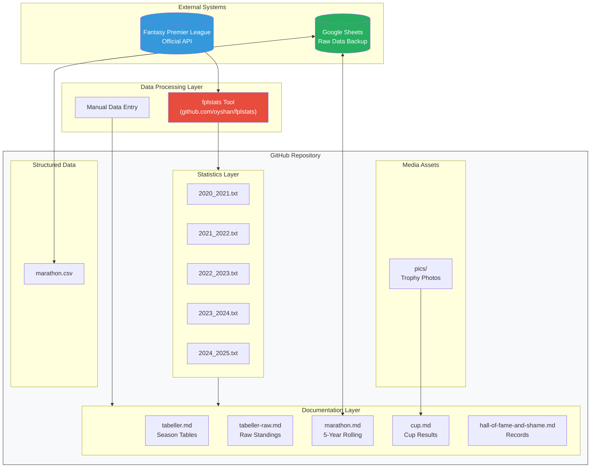
```mermaid
graph TB
    subgraph External["External Systems"]
        FPL[("Fantasy Premier League<br/>Official API")]
        GS[("Google Sheets<br/>Raw Data Backup")]
    end

    subgraph Processing["Data Processing Layer"]
        FPLSTATS["fplstats Tool<br/>(github.com/oyshan/fplstats)"]
        MANUAL["Manual Data Entry"]
    end

    subgraph Repository["GitHub Repository"]
        subgraph Docs["Documentation Layer"]
            TAB["tabeller.md<br/>Season Tables"]
            TABRAW["tabeller-raw.md<br/>Raw Standings"]
            MAR["marathon.md<br/>5-Year Rolling"]
            CUP["cup.md<br/>Cup Results"]
            HOF["hall-of-fame-and-shame.md<br/>Records"]
        end

        subgraph Stats["Statistics Layer"]
            S2020["2020_2021.txt"]
            S2021["2021_2022.txt"]
            S2022["2022_2023.txt"]
            S2023["2023_2024.txt"]
            S2024["2024_2025.txt"]
        end

        subgraph Assets["Media Assets"]
            PICS["pics/<br/>Trophy Photos"]
        end

        subgraph Data["Structured Data"]
            CSV["marathon.csv"]
        end
    end

    FPL --> FPLSTATS
    FPLSTATS --> Stats
    GS <--> MAR
    GS <--> CSV
    MANUAL --> Docs
    Stats --> Docs
    PICS --> CUP

    style FPL fill:#3498db,color:#fff
    style GS fill:#27ae60,color:#fff
    style FPLSTATS fill:#e74c3c,color:#fff
    style Repository fill:#f8f9fa,stroke:#333
```

### Component Interaction Flow

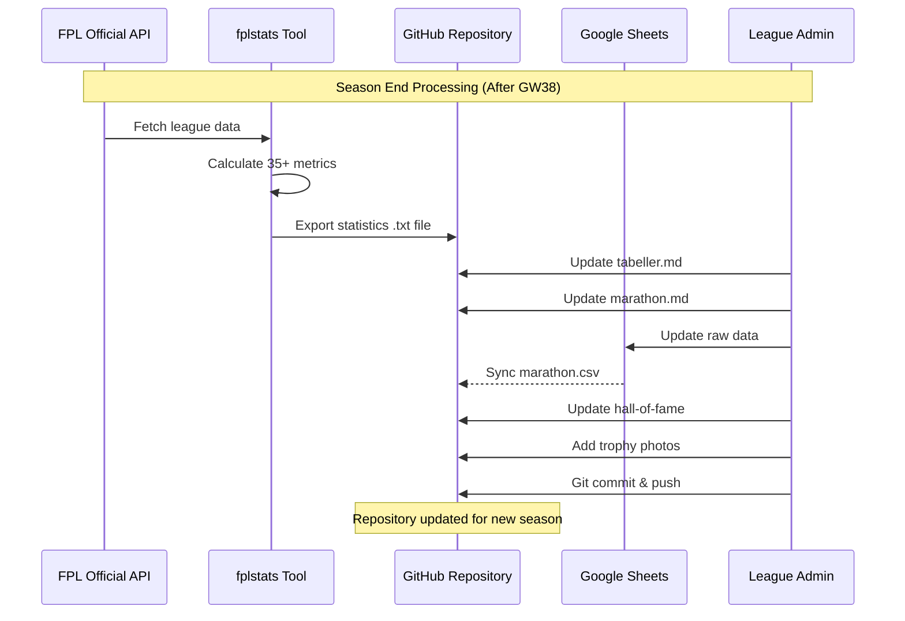
```mermaid
sequenceDiagram
    participant FPL as FPL Official API
    participant Stats as fplstats Tool
    participant Repo as GitHub Repository
    participant GS as Google Sheets
    participant User as League Admin

    Note over FPL,User: Season End Processing (After GW38)

    FPL->>Stats: Fetch league data
    Stats->>Stats: Calculate 35+ metrics
    Stats->>Repo: Export statistics .txt file

    User->>Repo: Update tabeller.md
    User->>Repo: Update marathon.md
    User->>GS: Update raw data
    GS-->>Repo: Sync marathon.csv

    User->>Repo: Update hall-of-fame
    User->>Repo: Add trophy photos
    User->>Repo: Git commit & push

    Note over Repo: Repository updated for new season
```

---

## Software Architecture

### Overview

The `src/` directory contains a complete Python-based FPL statistics analysis system:

| Component | Description | Lines of Code |
|-----------|-------------|---------------|
| **fplstats** | Core Python package | ~3,200 lines |
| **scripts** | CLI entry points | ~450 lines |
| **data** | Cached season data | 5 seasons (JSON) |

### Python Package Structure

```
src/
├── fplstats/                    # Core Python package
│   ├── __init__.py             # Package initialization
│   ├── models.py               # Pydantic data models (159 lines)
│   ├── enums.py                # Chip & Position enums (17 lines)
│   ├── constants.py            # Formation rules (5 lines)
│   ├── utils.py                # File I/O utilities (26 lines)
│   └── analyzers.py            # LeagueAnalyzer class (2,868 lines)
├── scripts/
│   ├── fetch_league.py         # FPL API data fetcher (401 lines)
│   └── analyze_league.py       # Statistics generator (54 lines)
├── data/                        # Cached JSON data by season
│   ├── 2020_2021/686617/
│   ├── 2021_2022/268207/
│   ├── 2022_2023/988260/
│   ├── 2023_2024/713444/
│   └── 2024_2025/1026627/
├── requirements.txt             # Python dependencies
├── mypy.ini                     # Type checking config
└── README.md                    # Setup instructions
```

### Software Component Diagram

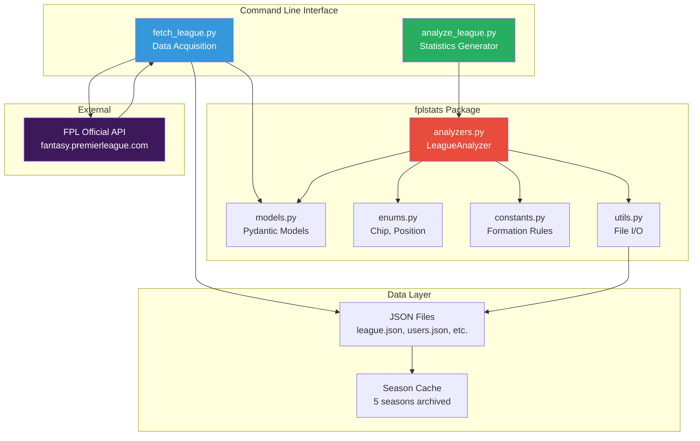
```mermaid
graph TB
    subgraph CLI["Command Line Interface"]
        FETCH["fetch_league.py<br/>Data Acquisition"]
        ANALYZE["analyze_league.py<br/>Statistics Generator"]
    end

    subgraph Package["fplstats Package"]
        MODELS["models.py<br/>Pydantic Models"]
        ENUMS["enums.py<br/>Chip, Position"]
        CONST["constants.py<br/>Formation Rules"]
        UTILS["utils.py<br/>File I/O"]
        ANALYZER["analyzers.py<br/>LeagueAnalyzer"]
    end

    subgraph Data["Data Layer"]
        JSON["JSON Files<br/>league.json, users.json, etc."]
        CACHE["Season Cache<br/>5 seasons archived"]
    end

    subgraph External["External"]
        FPLAPI["FPL Official API<br/>fantasy.premierleague.com"]
    end

    FETCH --> FPLAPI
    FPLAPI --> FETCH
    FETCH --> JSON
    FETCH --> MODELS

    ANALYZE --> ANALYZER
    ANALYZER --> MODELS
    ANALYZER --> ENUMS
    ANALYZER --> CONST
    ANALYZER --> UTILS
    UTILS --> JSON

    JSON --> CACHE

    style ANALYZER fill:#e74c3c,color:#fff
    style FETCH fill:#3498db,color:#fff
    style ANALYZE fill:#27ae60,color:#fff
    style FPLAPI fill:#3d195b,color:#fff
```

### LeagueAnalyzer Class Architecture

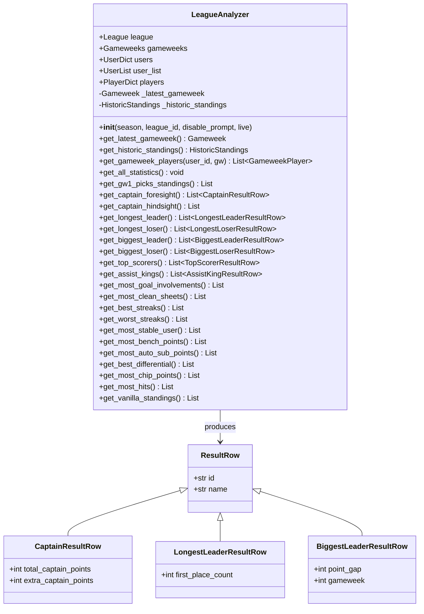
```mermaid
classDiagram
    class LeagueAnalyzer {
        +League league
        +Gameweeks gameweeks
        +UserDict users
        +UserList user_list
        +PlayerDict players
        -Gameweek _latest_gameweek
        -HistoricStandings _historic_standings

        +__init__(season, league_id, disable_prompt, live)
        +get_latest_gameweek() Gameweek
        +get_historic_standings() HistoricStandings
        +get_gameweek_players(user_id, gw) List~GameweekPlayer~
        +get_all_statistics() void

        +get_gw1_picks_standings() List
        +get_captain_foresight() List~CaptainResultRow~
        +get_captain_hindsight() List
        +get_longest_leader() List~LongestLeaderResultRow~
        +get_longest_loser() List~LongestLoserResultRow~
        +get_biggest_leader() List~BiggestLeaderResultRow~
        +get_biggest_loser() List~BiggestLoserResultRow~
        +get_top_scorers() List~TopScorerResultRow~
        +get_assist_kings() List~AssistKingResultRow~
        +get_most_goal_involvements() List
        +get_most_clean_sheets() List
        +get_best_streaks() List
        +get_worst_streaks() List
        +get_most_stable_user() List
        +get_most_bench_points() List
        +get_most_auto_sub_points() List
        +get_best_differential() List
        +get_most_chip_points() List
        +get_most_hits() List
        +get_vanilla_standings() List
    }

    class ResultRow {
        +str id
        +str name
    }

    class CaptainResultRow {
        +int total_captain_points
        +int extra_captain_points
    }

    class LongestLeaderResultRow {
        +int first_place_count
    }

    class BiggestLeaderResultRow {
        +int point_gap
        +int gameweek
    }

    ResultRow <|-- CaptainResultRow
    ResultRow <|-- LongestLeaderResultRow
    ResultRow <|-- BiggestLeaderResultRow
    LeagueAnalyzer --> ResultRow : produces
```

### CLI Pipeline Architecture

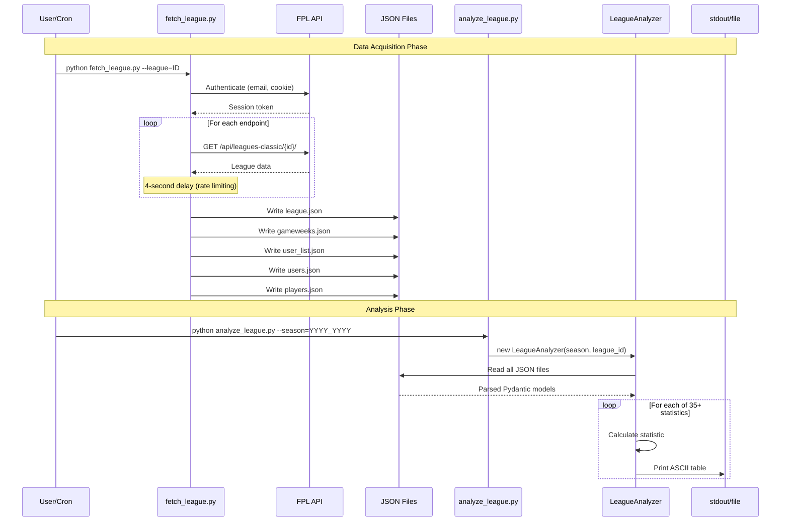
```mermaid
sequenceDiagram
    participant User as User/Cron
    participant Fetch as fetch_league.py
    participant FPL as FPL API
    participant JSON as JSON Files
    participant Analyze as analyze_league.py
    participant LA as LeagueAnalyzer
    participant Out as stdout/file

    Note over User,Out: Data Acquisition Phase

    User->>Fetch: python fetch_league.py --league=ID
    Fetch->>FPL: Authenticate (email, cookie)
    FPL-->>Fetch: Session token

    loop For each endpoint
        Fetch->>FPL: GET /api/leagues-classic/{id}/
        FPL-->>Fetch: League data
        Note over Fetch: 4-second delay (rate limiting)
    end

    Fetch->>JSON: Write league.json
    Fetch->>JSON: Write gameweeks.json
    Fetch->>JSON: Write user_list.json
    Fetch->>JSON: Write users.json
    Fetch->>JSON: Write players.json

    Note over User,Out: Analysis Phase

    User->>Analyze: python analyze_league.py --season=YYYY_YYYY
    Analyze->>LA: new LeagueAnalyzer(season, league_id)
    LA->>JSON: Read all JSON files
    JSON-->>LA: Parsed Pydantic models

    loop For each of 35+ statistics
        LA->>LA: Calculate statistic
        LA->>Out: Print ASCII table
    end
```

### Technology Stack

| Layer | Technology | Version | Purpose |
|-------|------------|---------|---------|
| **Runtime** | Python | 3.13 | Core language |
| **Data Validation** | Pydantic | 1.8.1 | Schema validation |
| **API Client** | fpl | 0.6.35 | FPL API wrapper |
| **Output** | PrettyTable | 2.1.0 | ASCII tables |
| **Type Checking** | mypy | 0.930 | Static analysis |
| **Formatting** | black | 21.5b0 | Code style |
| **Linting** | flake8 | 3.9.1 | Code quality |

### Dependency Graph

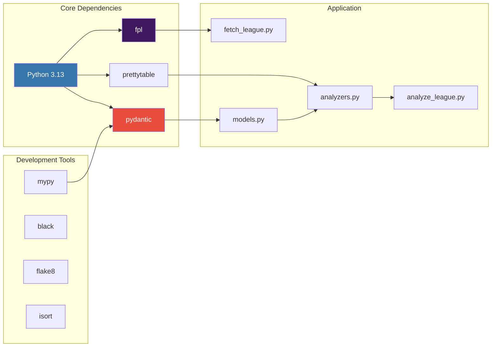
```mermaid
graph LR
    subgraph Core["Core Dependencies"]
        PY["Python 3.13"]
        PYD["pydantic"]
        FPL["fpl"]
        PT["prettytable"]
    end

    subgraph Dev["Development Tools"]
        MYPY["mypy"]
        BLACK["black"]
        FLAKE["flake8"]
        ISORT["isort"]
    end

    subgraph App["Application"]
        FETCH["fetch_league.py"]
        ANALYZE["analyze_league.py"]
        ANALYZER["analyzers.py"]
        MODELS["models.py"]
    end

    PY --> PYD & FPL & PT
    PYD --> MODELS
    FPL --> FETCH
    PT --> ANALYZER
    MODELS --> ANALYZER
    ANALYZER --> ANALYZE

    MYPY --> PYD

    style PY fill:#3776ab,color:#fff
    style PYD fill:#e74c3c,color:#fff
    style FPL fill:#3d195b,color:#fff
```

---

## Data Flow

### Annual Data Flow Cycle

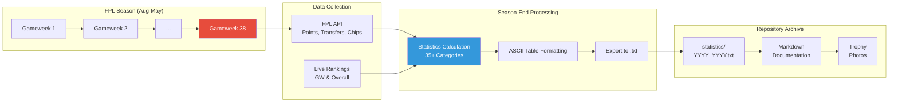
```mermaid
flowchart LR
    subgraph Season["FPL Season (Aug-May)"]
        GW1["Gameweek 1"]
        GW2["Gameweek 2"]
        GWN["..."]
        GW38["Gameweek 38"]
    end

    subgraph Collection["Data Collection"]
        API["FPL API<br/>Points, Transfers, Chips"]
        LIVE["Live Rankings<br/>GW & Overall"]
    end

    subgraph Processing["Season-End Processing"]
        CALC["Statistics Calculation<br/>35+ Categories"]
        FORMAT["ASCII Table Formatting"]
        EXPORT["Export to .txt"]
    end

    subgraph Archive["Repository Archive"]
        STATS["statistics/<br/>YYYY_YYYY.txt"]
        DOCS["Markdown<br/>Documentation"]
        MEDIA["Trophy<br/>Photos"]
    end

    GW1 --> GW2 --> GWN --> GW38
    GW38 --> API
    API --> CALC
    LIVE --> CALC
    CALC --> FORMAT --> EXPORT
    EXPORT --> STATS
    STATS --> DOCS
    DOCS --> MEDIA

    style GW38 fill:#e74c3c,color:#fff
    style CALC fill:#3498db,color:#fff
```

### Data Transformation Pipeline

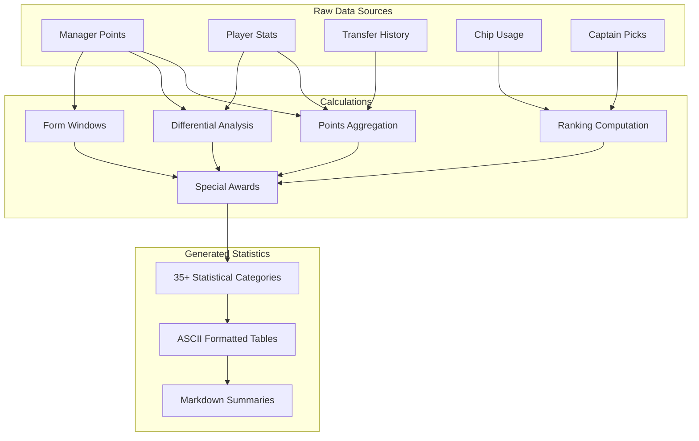
```mermaid
flowchart TD
    subgraph Input["Raw Data Sources"]
        A1["Manager Points"]
        A2["Player Stats"]
        A3["Transfer History"]
        A4["Chip Usage"]
        A5["Captain Picks"]
    end

    subgraph Transform["Calculations"]
        B1["Points Aggregation"]
        B2["Ranking Computation"]
        B3["Differential Analysis"]
        B4["Form Windows"]
        B5["Special Awards"]
    end

    subgraph Output["Generated Statistics"]
        C1["35+ Statistical Categories"]
        C2["ASCII Formatted Tables"]
        C3["Markdown Summaries"]
    end

    A1 & A2 & A3 --> B1
    A4 & A5 --> B2
    A1 & A2 --> B3
    A1 --> B4
    B1 & B2 & B3 & B4 --> B5

    B5 --> C1 --> C2 --> C3
```

---

## Repository Structure

```
fantasypl/
├── .gitignore                    # Excludes .DS_Store
├── cup.md                        # Cup competition results
├── hall-of-fame-and-shame.md     # League records & achievements
├── marathon.csv                  # Structured 10-year data
├── marathon.md                   # 5-year rolling rankings
├── tabeller.md                   # Visual season tables
├── tabeller-raw.md               # Raw standings data
├── statistics/                   # Detailed season analytics (generated)
│   ├── 2020_2021.txt            # ~750 lines, 35+ categories
│   ├── 2021_2022.txt
│   ├── 2022_2023.txt
│   ├── 2023_2024.txt
│   └── 2024_2025.txt
├── pics/                         # Trophy/celebration photos
│   ├── 2022_2023/
│   │   ├── winner.jpg
│   │   ├── cup_and_balls.jpg
│   │   └── cup_and_balls2.jpg
│   └── 2023_2024/
│       ├── winner.jpg
│       ├── balls.jpg
│       └── cup.jpg
├── src/                          # Python statistics tool
│   ├── fplstats/                # Core analysis package
│   │   ├── models.py           # Pydantic data models
│   │   ├── analyzers.py        # LeagueAnalyzer (40+ methods)
│   │   ├── enums.py            # Chip, Position enums
│   │   ├── constants.py        # Formation rules
│   │   └── utils.py            # File I/O utilities
│   ├── scripts/                 # CLI entry points
│   │   ├── fetch_league.py     # FPL API data fetcher
│   │   └── analyze_league.py   # Statistics generator
│   ├── data/                    # Cached JSON data (5 seasons)
│   │   └── {season}/{league_id}/
│   ├── requirements.txt         # Python dependencies
│   └── README.md               # Setup instructions
└── docs/                         # Documentation
    ├── README.md               # Documentation index
    ├── ARCHITECTURE.md         # This file
    ├── PROCEDURES.md           # Operating procedures
    └── STATISTICS-REFERENCE.md # Statistics guide
```

### File Size Distribution

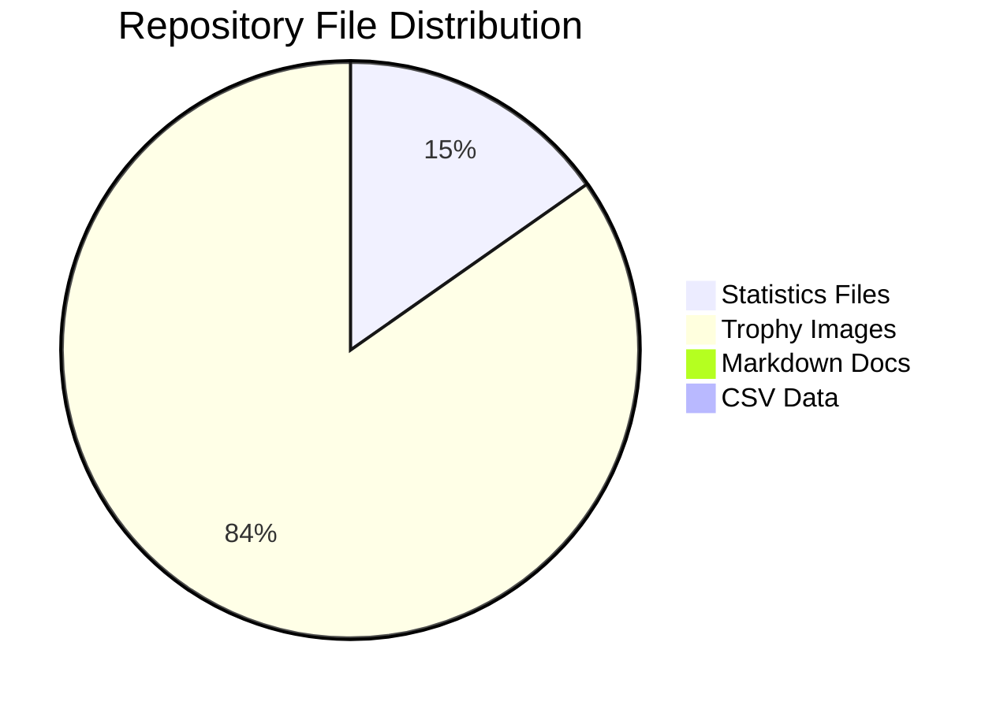
```mermaid
pie title Repository File Distribution
    "Statistics Files" : 288
    "Trophy Images" : 1600
    "Markdown Docs" : 13
    "CSV Data" : 2
```

---

## Components

### Documentation Files

| File | Purpose | Update Frequency |
|------|---------|------------------|
| `tabeller.md` | Visual season tables with screenshots | End of season |
| `tabeller-raw.md` | Raw markdown standings tables | End of season |
| `marathon.md` | 5-year rolling sum rankings | End of season |
| `marathon.csv` | Machine-readable marathon data | End of season |
| `cup.md` | Cup competition finals & photos | End of season |
| `hall-of-fame-and-shame.md` | All-time records | When records broken |

### Statistics Files Structure

Each `statistics/YYYY_YYYY.txt` file contains:

```
┌────────────────────────────────────────────────────────────┐
│ ÅRETS [CATEGORY NAME]                                      │
├────────────────────────────────────────────────────────────┤
│ Manager      │ Metric 1    │ Metric 2    │ Metric 3      │
│──────────────┼─────────────┼─────────────┼───────────────│
│ Øystein      │ 2,601       │ 2,011       │ ...           │
│ Håvard       │ 2,456       │ 15,234      │ ...           │
│ ...          │ ...         │ ...         │ ...           │
└────────────────────────────────────────────────────────────┘
```

---

## External Integrations

### Integration Architecture

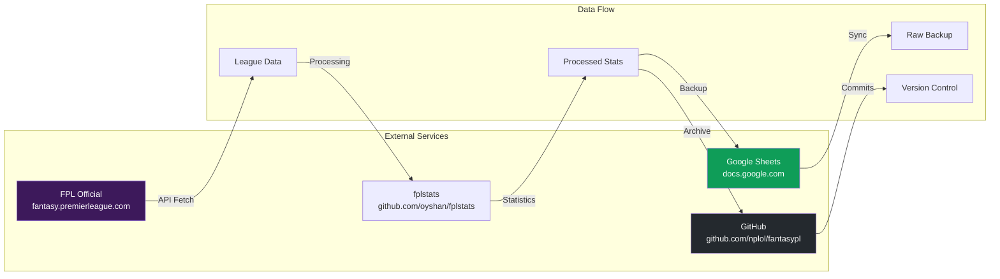
```mermaid
graph LR
    subgraph External["External Services"]
        FPL["FPL Official<br/>fantasy.premierleague.com"]
        FPLSTATS["fplstats<br/>github.com/oyshan/fplstats"]
        GS["Google Sheets<br/>docs.google.com"]
        GH["GitHub<br/>github.com/nplol/fantasypl"]
    end

    subgraph DataFlow["Data Flow"]
        direction TB
        D1["League Data"]
        D2["Processed Stats"]
        D3["Raw Backup"]
        D4["Version Control"]
    end

    FPL -->|"API Fetch"| D1
    D1 -->|"Processing"| FPLSTATS
    FPLSTATS -->|"Statistics"| D2
    D2 -->|"Archive"| GH
    D2 -->|"Backup"| GS
    GS -->|"Sync"| D3
    GH -->|"Commits"| D4

    style FPL fill:#3d195b,color:#fff
    style GS fill:#0f9d58,color:#fff
    style GH fill:#24292e,color:#fff
```

### Integration Details

| System | Purpose | Access Method | Data Direction |
|--------|---------|---------------|----------------|
| FPL API | Source data | HTTP/REST | Inbound |
| fplstats | Processing | Local execution | Transform |
| Google Sheets | Backup | Shared document | Bidirectional |
| GitHub | Archive | Git push | Outbound |

### Google Sheets Integration

- **URL**: `https://docs.google.com/spreadsheets/d/137-UoJ2gj5-bD5h-LOOTsttm35dNv5QM7CocSbs0Zio`
- **Purpose**: Live data maintenance and collaborative editing
- **Sync**: Manual sync to `marathon.csv`

---

## Data Models

### Manager Data Model

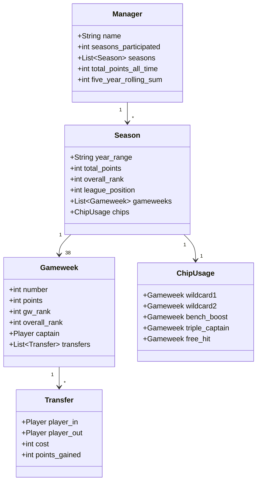
```mermaid
classDiagram
    class Manager {
        +String name
        +int seasons_participated
        +List~Season~ seasons
        +int total_points_all_time
        +int five_year_rolling_sum
    }

    class Season {
        +String year_range
        +int total_points
        +int overall_rank
        +int league_position
        +List~Gameweek~ gameweeks
        +ChipUsage chips
    }

    class Gameweek {
        +int number
        +int points
        +int gw_rank
        +int overall_rank
        +Player captain
        +List~Transfer~ transfers
    }

    class ChipUsage {
        +Gameweek wildcard1
        +Gameweek wildcard2
        +Gameweek bench_boost
        +Gameweek triple_captain
        +Gameweek free_hit
    }

    class Transfer {
        +Player player_in
        +Player player_out
        +int cost
        +int points_gained
    }

    Manager "1" --> "*" Season
    Season "1" --> "38" Gameweek
    Season "1" --> "1" ChipUsage
    Gameweek "1" --> "*" Transfer
```

### Statistics Category Model

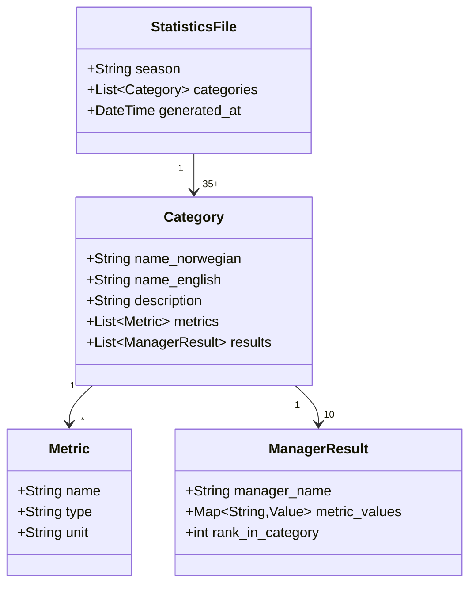
```mermaid
classDiagram
    class StatisticsFile {
        +String season
        +List~Category~ categories
        +DateTime generated_at
    }

    class Category {
        +String name_norwegian
        +String name_english
        +String description
        +List~Metric~ metrics
        +List~ManagerResult~ results
    }

    class Metric {
        +String name
        +String type
        +String unit
    }

    class ManagerResult {
        +String manager_name
        +Map~String,Value~ metric_values
        +int rank_in_category
    }

    StatisticsFile "1" --> "35+" Category
    Category "1" --> "*" Metric
    Category "1" --> "10" ManagerResult
```

---

## Code Data Models

### Pydantic Model Hierarchy

The `src/fplstats/models.py` file defines type-safe data structures using Pydantic:

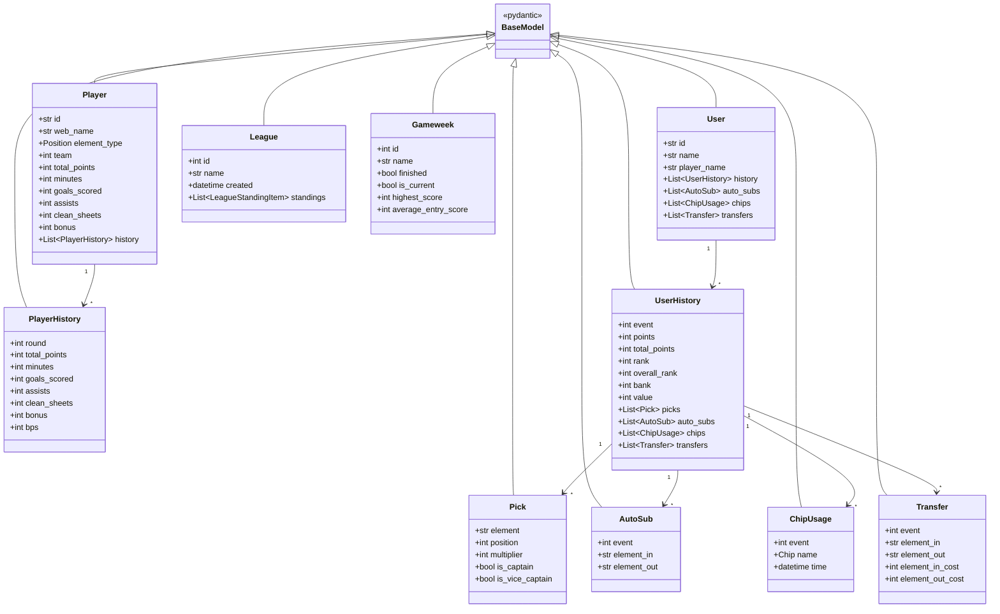
```mermaid
classDiagram
    class BaseModel {
        <<pydantic>>
    }

    class Player {
        +str id
        +str web_name
        +Position element_type
        +int team
        +int total_points
        +int minutes
        +int goals_scored
        +int assists
        +int clean_sheets
        +int bonus
        +List~PlayerHistory~ history
    }

    class PlayerHistory {
        +int round
        +int total_points
        +int minutes
        +int goals_scored
        +int assists
        +int clean_sheets
        +int bonus
        +int bps
    }

    class User {
        +str id
        +str name
        +str player_name
        +List~UserHistory~ history
        +List~AutoSub~ auto_subs
        +List~ChipUsage~ chips
        +List~Transfer~ transfers
    }

    class UserHistory {
        +int event
        +int points
        +int total_points
        +int rank
        +int overall_rank
        +int bank
        +int value
        +List~Pick~ picks
        +List~AutoSub~ auto_subs
        +List~ChipUsage~ chips
        +List~Transfer~ transfers
    }

    class Pick {
        +str element
        +int position
        +int multiplier
        +bool is_captain
        +bool is_vice_captain
    }

    class AutoSub {
        +int event
        +str element_in
        +str element_out
    }

    class ChipUsage {
        +int event
        +Chip name
        +datetime time
    }

    class Transfer {
        +int event
        +str element_in
        +str element_out
        +int element_in_cost
        +int element_out_cost
    }

    class League {
        +int id
        +str name
        +datetime created
        +List~LeagueStandingItem~ standings
    }

    class Gameweek {
        +int id
        +str name
        +bool finished
        +bool is_current
        +int highest_score
        +int average_entry_score
    }

    BaseModel <|-- Player
    BaseModel <|-- PlayerHistory
    BaseModel <|-- User
    BaseModel <|-- UserHistory
    BaseModel <|-- Pick
    BaseModel <|-- AutoSub
    BaseModel <|-- ChipUsage
    BaseModel <|-- Transfer
    BaseModel <|-- League
    BaseModel <|-- Gameweek

    Player "1" --> "*" PlayerHistory
    User "1" --> "*" UserHistory
    UserHistory "1" --> "*" Pick
    UserHistory "1" --> "*" AutoSub
    UserHistory "1" --> "*" ChipUsage
    UserHistory "1" --> "*" Transfer
```

### Enumeration Types

```python
# src/fplstats/enums.py

class Chip(Enum):
    TRIPLE_CAPTAIN = "3xc"      # 3× captain points
    BENCH_BOOST = "bboost"      # All 15 players score
    FREE_HIT = "freehit"        # Temporary unlimited transfers
    WILDCARD = "wildcard"       # Unlimited transfers (permanent)
    ASSMAN = "manager"          # Assistant manager mode

class Position(Enum):
    GOALKEEPER = 1
    DEFENDER = 2
    MIDFIELDER = 3
    ATTACKER = 4
    MANAGER = 5
```

### Formation Constants

```python
# src/fplstats/constants.py

MIN_DEFS = 3   # Minimum 3 defenders in valid formation
MIN_MIDS = 2   # Minimum 2 midfielders in valid formation
MIN_FWDS = 1   # Minimum 1 forward in valid formation
```

### JSON Data File Structure

Each season's data is stored in `src/data/{season}/{league_id}/`:

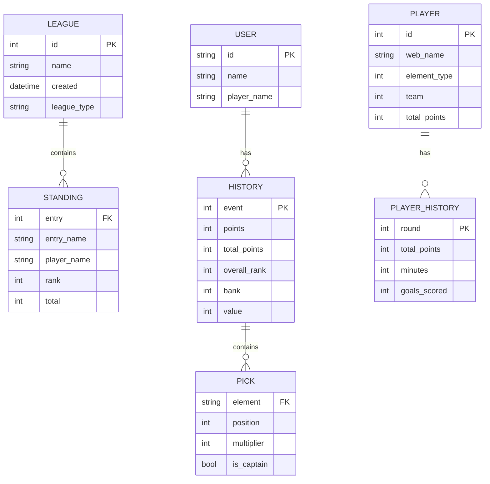
```mermaid
erDiagram
    LEAGUE ||--o{ STANDING : contains
    LEAGUE {
        int id PK
        string name
        datetime created
        string league_type
    }
    STANDING {
        int entry FK
        string entry_name
        string player_name
        int rank
        int total
    }

    USER ||--o{ HISTORY : has
    USER {
        string id PK
        string name
        string player_name
    }
    HISTORY {
        int event PK
        int points
        int total_points
        int overall_rank
        int bank
        int value
    }

    HISTORY ||--o{ PICK : contains
    PICK {
        string element FK
        int position
        int multiplier
        bool is_captain
    }

    PLAYER ||--o{ PLAYER_HISTORY : has
    PLAYER {
        int id PK
        string web_name
        int element_type
        int team
        int total_points
    }
    PLAYER_HISTORY {
        int round PK
        int total_points
        int minutes
        int goals_scored
    }
```

### Type Aliases

```python
# Used throughout the codebase

Gameweeks = List[Gameweek]                    # All 38 gameweeks
PlayerDict = Dict[str, Player]                # Players by ID
UserDict = Dict[str, User]                    # Users by ID
UserList = List[UserListItem]                 # Simple user references
LeagueStandings = List[LeagueStandingItem]    # Final standings
HistoricStandings = List[List[HistoricStandingListItem]]  # GW-by-GW
```

---

## Special Procedures

### Procedure 1: Season-End Statistics Generation

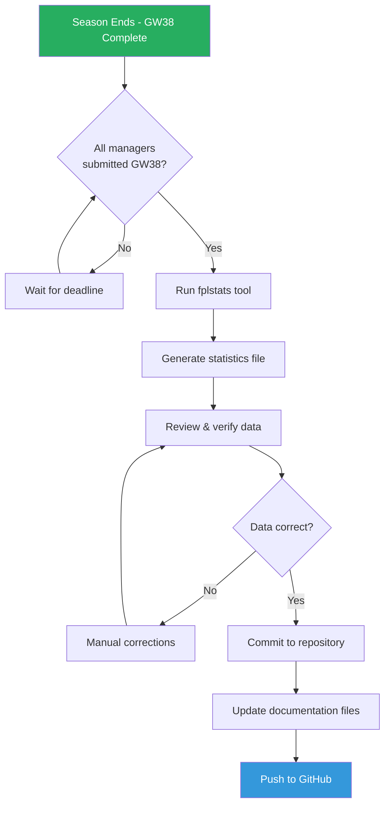
```mermaid
flowchart TD
    A[Season Ends - GW38 Complete] --> B{All managers<br/>submitted GW38?}
    B -->|No| C[Wait for deadline]
    C --> B
    B -->|Yes| D[Run fplstats tool]
    D --> E[Generate statistics file]
    E --> F[Review & verify data]
    F --> G{Data correct?}
    G -->|No| H[Manual corrections]
    H --> F
    G -->|Yes| I[Commit to repository]
    I --> J[Update documentation files]
    J --> K[Push to GitHub]

    style A fill:#27ae60,color:#fff
    style K fill:#3498db,color:#fff
```

**Steps:**
1. Wait for GW38 to complete and all points finalized
2. Execute fplstats tool against league data
3. Export statistics to `statistics/YYYY_YYYY.txt`
4. Verify all 35+ categories generated correctly
5. Commit file with message "YYYY/YY" (e.g., "2024/25")
6. Update markdown documentation files
7. Push to master branch

### Procedure 2: Marathon Table Update

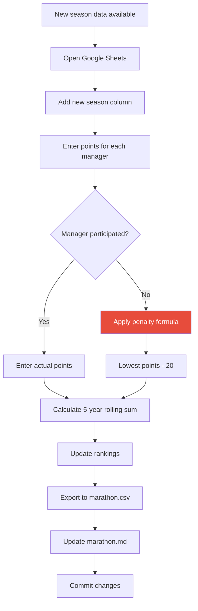
```mermaid
flowchart TD
    A[New season data available] --> B[Open Google Sheets]
    B --> C[Add new season column]
    C --> D[Enter points for each manager]
    D --> E{Manager participated?}
    E -->|Yes| F[Enter actual points]
    E -->|No| G[Apply penalty formula]
    G --> H["Lowest points - 20"]
    F --> I[Calculate 5-year rolling sum]
    H --> I
    I --> J[Update rankings]
    J --> K[Export to marathon.csv]
    K --> L[Update marathon.md]
    L --> M[Commit changes]

    style G fill:#e74c3c,color:#fff
```

**Non-Participation Penalty Formula:**
```
penalty_points = min(all_manager_points_this_season) - 20
```

### Procedure 3: Hall of Fame/Shame Update

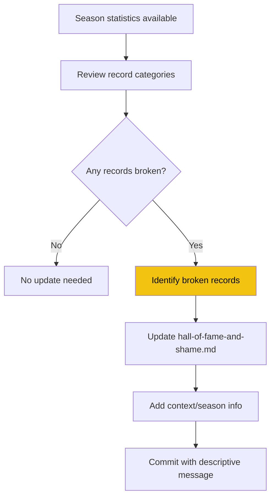
```mermaid
flowchart TD
    A[Season statistics available] --> B[Review record categories]
    B --> C{Any records broken?}
    C -->|No| D[No update needed]
    C -->|Yes| E[Identify broken records]
    E --> F[Update hall-of-fame-and-shame.md]
    F --> G[Add context/season info]
    G --> H[Commit with descriptive message]

    style E fill:#f1c40f,color:#000
```

**Record Categories Tracked:**

| Hall of Fame | Hall of Shame |
|--------------|---------------|
| Highest GW rank | Lowest GW rank |
| Most participations | Traitor award (non-participation) |
| Most league titles | Lowest overall rank |
| Highest season points | - |
| Highest GW38 rank | - |

### Procedure 4: Cup Results Documentation

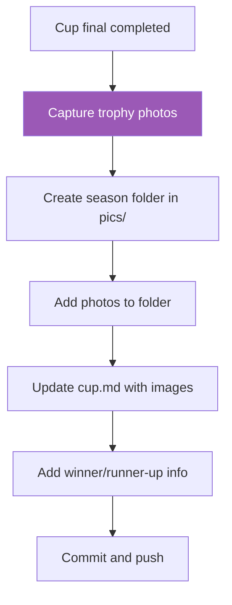
```mermaid
flowchart TD
    A[Cup final completed] --> B[Capture trophy photos]
    B --> C[Create season folder in pics/]
    C --> D[Add photos to folder]
    D --> E[Update cup.md with images]
    E --> F[Add winner/runner-up info]
    F --> G[Commit and push]

    style B fill:#9b59b6,color:#fff
```

---

## Statistics Categories

### Complete Category Reference

The statistics system tracks **35+ categories** per season. Below is the complete reference:

#### Performance Categories

| Norwegian | English | Description |
|-----------|---------|-------------|
| ÅRETS VISJONÆRE | Visionary | What-if analysis for GW1 frozen picks |
| ÅRETS CAPTAIN FORESIGHT | Captain Foresight | Extra points from captaincy |
| ÅRETS CAPTAIN HINDSIGHT | Captain Hindsight | Points excluding captain bonus |
| ÅRETS MVP | MVP | Highest-scoring player per team |
| ÅRETS BESTE DIFF | Best Differential | Low-ownership high-point picks |

#### Position Categories

| Norwegian | English | Description |
|-----------|---------|-------------|
| ÅRETS LENGSTE LEDER | Longest Leader | Most GWs in 1st place |
| ÅRETS LENGSTE BALLETAK | Longest Bottom | Most GWs in last place |
| ÅRETS STØRSTE LEDER | Biggest Leader | Largest point gap when 1st |
| ÅRETS STØRSTE BALLETAK | Biggest Deficit | Largest gap when last |
| ÅRETS VINGLEPETTER | Position Swinger | Most different positions held |

#### Player Statistics

| Norwegian | English | Description |
|-----------|---------|-------------|
| ÅRETS GULLSTØVEL | Golden Boot | Most goals |
| ÅRETS ASSISTKONGE | Assist King | Most assists |
| ÅRETS MÅLRETTEDE | Goal + Assist | Combined attacking returns |
| ÅRETS FORSVARSLØSE | Defenseless | Most goals conceded |
| ÅRETS SKUDDSIKRE | Clean Sheet King | Most clean sheets |
| ÅRETS KEEPER | Goalkeeper | Best GK performance |

#### Form Categories

| Norwegian | English | Description |
|-----------|---------|-------------|
| ÅRETS FORMSPILLER | Form Player | Best 5-GW window |
| ÅRETS UTE-AV-FORMSPILLER | Out of Form | Worst 5-GW window |
| ÅRETS STABILE | Most Stable | Smallest GW variance |
| ÅRETS HIGHSCORE | High Score | Best single GW |
| ÅRETS LOWSCORE | Low Score | Worst single GW |

#### Squad Management

| Norwegian | English | Description |
|-----------|---------|-------------|
| ÅRETS BENKESLITER | Bench Warmer | Most unused bench points |
| ÅRETS SUPERINNBYTTER | Super Sub | Most auto-sub points |
| ÅRETS RUNDBRENNER | Rotation Master | Most unique players used |
| ÅRETS TEMPLATE | Template | Highest avg ownership |

#### Chip & Transfer

| Norwegian | English | Description |
|-----------|---------|-------------|
| ÅRETS CHIPP-KONGE | Chip King | Most chip points |
| ÅRETS PIMP | Transfer Master | Best transfer timing |
| ÅRETS SPÅMANN | Prophet | Same-GW transfer in points |
| ÅRETS KARMA | Karma | Same-GW transfer out points |

#### Negative Categories

| Norwegian | English | Description |
|-----------|---------|-------------|
| ÅRETS STYGGE SPILLER | Dirty Player | Most card points lost |
| ÅRETS SELVEIDE | Own Goal | Most own goals |
| ÅRETS BOMSPILLER | Penalty Miss | Most penalties missed |

#### Ranking Categories

| Norwegian | English | Description |
|-----------|---------|-------------|
| ÅRETS HØYESTE RANK | Highest Rank | Best GW/overall rank |
| ÅRETS LAVESTE RANK | Lowest Rank | Worst GW/overall rank |
| ÅRETS BONUSSPILLER | Bonus King | Most bonus points |
| ÅRETS VANILLA | Vanilla | Raw points (no chips/captain) |

---

## Appendices

### Appendix A: Git Commit Convention

```
# Season update
YYYY/YY

# File updates
Update [filename].md

# Corrections
Fix [description]

# New content
Add [description]
```

### Appendix B: File Naming Convention

```
Statistics:  YYYY_YYYY.txt (e.g., 2024_2025.txt)
Images:      descriptive-name.jpg
Data:        descriptive-name.csv/md
```

### Appendix C: External Resources

| Resource | URL |
|----------|-----|
| FPL Official | https://fantasy.premierleague.com |
| fplstats Tool | https://github.com/oyshan/fplstats |
| Google Sheets | https://docs.google.com/spreadsheets/d/137-UoJ2gj5-bD5h-LOOTsttm35dNv5QM7CocSbs0Zio |
| Repository | https://github.com/nplol/fantasypl |

### Appendix D: Historical Timeline

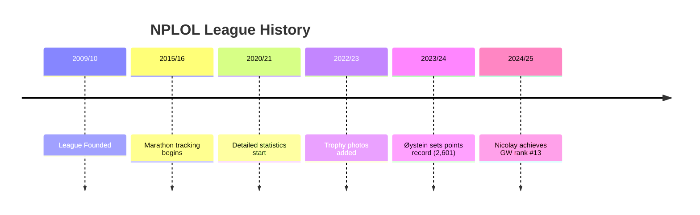
```mermaid
timeline
    title NPLOL League History
    2009/10 : League Founded
    2015/16 : Marathon tracking begins
    2020/21 : Detailed statistics start
    2022/23 : Trophy photos added
    2023/24 : Øystein sets points record (2,601)
    2024/25 : Nicolay achieves GW rank #13
```

---

*Documentation generated: December 2025*
*Repository: github.com/nplol/fantasypl*
