# NPLOL Fantasy Premier League - System Architecture

> Comprehensive documentation for the Norwegian FPL League (nplol) statistics and tracking system

## Table of Contents

1. [Overview](#overview)
2. [System Architecture](#system-architecture)
3. [Data Flow](#data-flow)
4. [Repository Structure](#repository-structure)
5. [Components](#components)
6. [External Integrations](#external-integrations)
7. [Data Models](#data-models)
8. [Special Procedures](#special-procedures)
9. [Statistics Categories](#statistics-categories)
10. [Appendices](#appendices)

---

## Overview

### Project Summary

| Attribute | Value |
|-----------|-------|
| **Project Name** | fantasypl |
| **Type** | Documentation & Statistics Repository |
| **Purpose** | Track and archive FPL league performance |
| **Participants** | 10 Norwegian fantasy managers |
| **History** | 2009/10 - Present (16+ seasons) |
| **Repository** | github.com/nplol/fantasypl |

### League Participants

```
1. Øystein      6. Øyvind
2. Håvard       7. Jørgen
3. Andreas      8. Snorre
4. Nicolay      9. Severin
5. Torbjørn    10. Steffen
```

---

## System Architecture

### High-Level Architecture Diagram

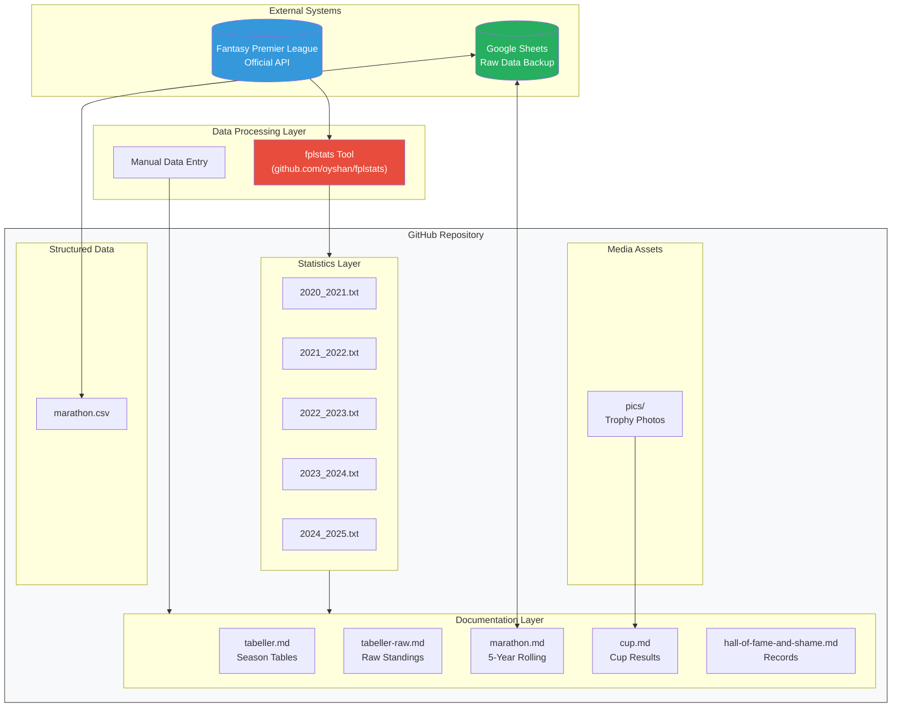

### Component Interaction Flow

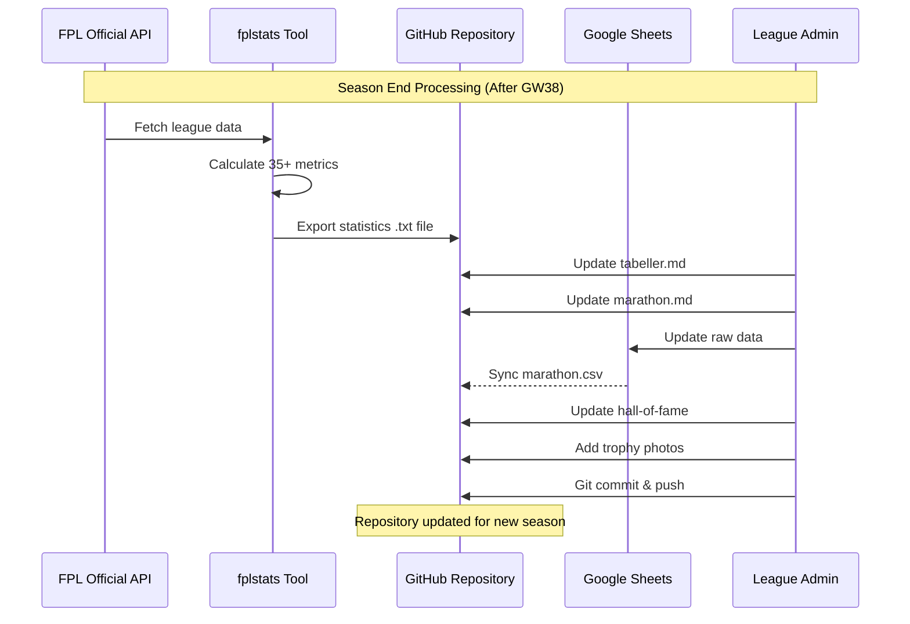

---

## Data Flow

### Annual Data Flow Cycle

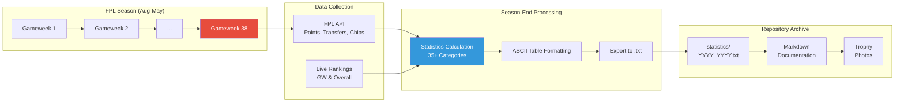

### Data Transformation Pipeline

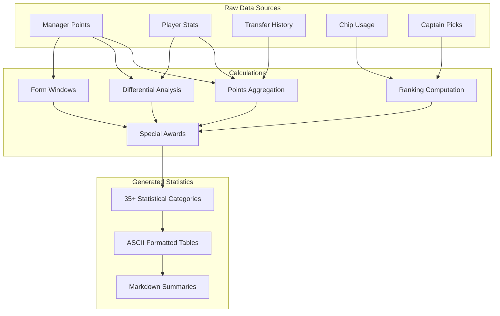

---

## Repository Structure

```
fantasypl/
├── .gitignore                    # Excludes .DS_Store
├── cup.md                        # Cup competition results
├── hall-of-fame-and-shame.md     # League records & achievements
├── marathon.csv                  # Structured 10-year data
├── marathon.md                   # 5-year rolling rankings
├── tabeller.md                   # Visual season tables
├── tabeller-raw.md               # Raw standings data
├── statistics/                   # Detailed season analytics
│   ├── 2020_2021.txt            # ~750 lines, 35+ categories
│   ├── 2021_2022.txt
│   ├── 2022_2023.txt
│   ├── 2023_2024.txt
│   └── 2024_2025.txt
├── pics/                         # Trophy/celebration photos
│   ├── 2022_2023/
│   │   ├── winner.jpg
│   │   ├── cup_and_balls.jpg
│   │   └── cup_and_balls2.jpg
│   └── 2023_2024/
│       ├── winner.jpg
│       ├── balls.jpg
│       └── cup.jpg
└── docs/                         # Documentation (this file)
    └── ARCHITECTURE.md
```

### File Size Distribution

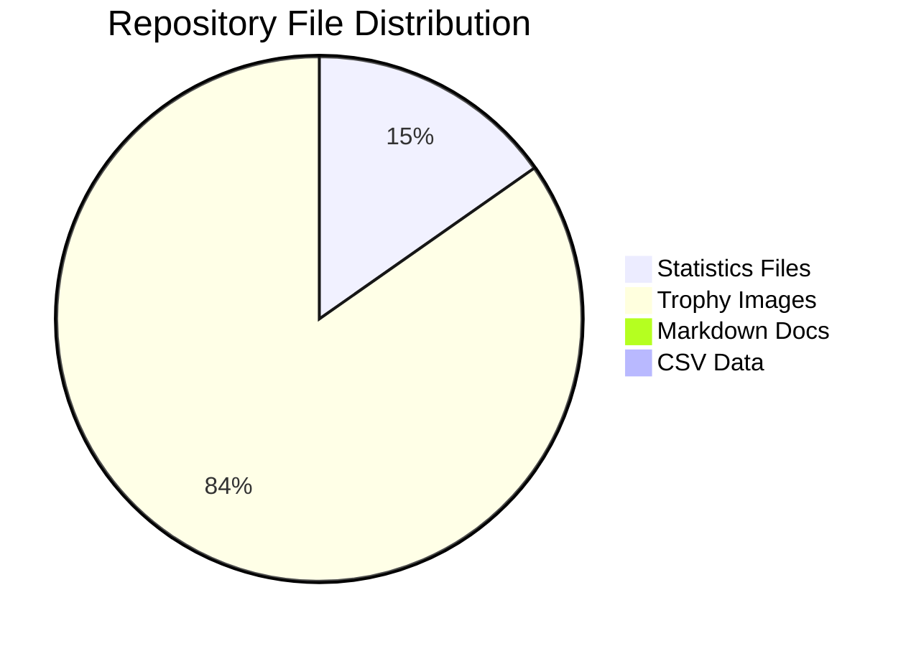

---

## Components

### Documentation Files

| File | Purpose | Update Frequency |
|------|---------|------------------|
| `tabeller.md` | Visual season tables with screenshots | End of season |
| `tabeller-raw.md` | Raw markdown standings tables | End of season |
| `marathon.md` | 5-year rolling sum rankings | End of season |
| `marathon.csv` | Machine-readable marathon data | End of season |
| `cup.md` | Cup competition finals & photos | End of season |
| `hall-of-fame-and-shame.md` | All-time records | When records broken |

### Statistics Files Structure

Each `statistics/YYYY_YYYY.txt` file contains:

```
┌────────────────────────────────────────────────────────────┐
│ ÅRETS [CATEGORY NAME]                                      │
├────────────────────────────────────────────────────────────┤
│ Manager      │ Metric 1    │ Metric 2    │ Metric 3      │
│──────────────┼─────────────┼─────────────┼───────────────│
│ Øystein      │ 2,601       │ 2,011       │ ...           │
│ Håvard       │ 2,456       │ 15,234      │ ...           │
│ ...          │ ...         │ ...         │ ...           │
└────────────────────────────────────────────────────────────┘
```

---

## External Integrations

### Integration Architecture

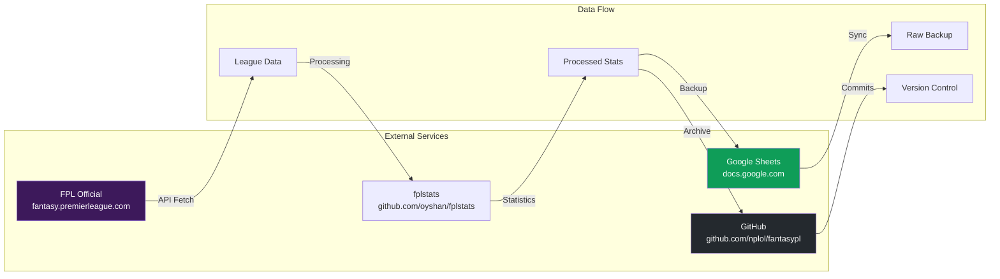

### Integration Details

| System | Purpose | Access Method | Data Direction |
|--------|---------|---------------|----------------|
| FPL API | Source data | HTTP/REST | Inbound |
| fplstats | Processing | Local execution | Transform |
| Google Sheets | Backup | Shared document | Bidirectional |
| GitHub | Archive | Git push | Outbound |

### Google Sheets Integration

- **URL**: `https://docs.google.com/spreadsheets/d/137-UoJ2gj5-bD5h-LOOTsttm35dNv5QM7CocSbs0Zio`
- **Purpose**: Live data maintenance and collaborative editing
- **Sync**: Manual sync to `marathon.csv`

---

## Data Models

### Manager Data Model

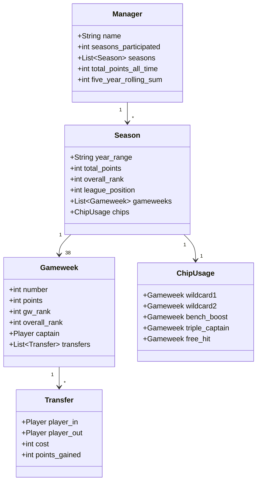

### Statistics Category Model

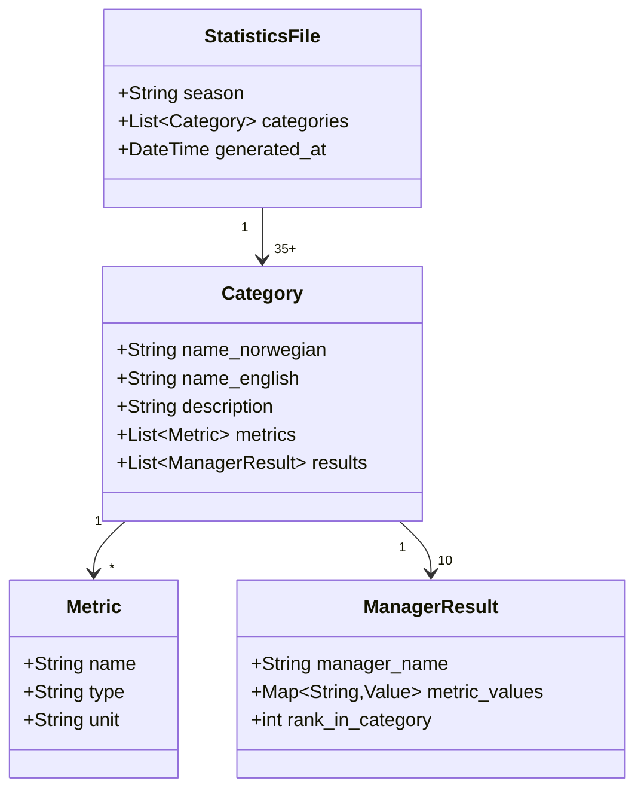

---

## Special Procedures

### Procedure 1: Season-End Statistics Generation

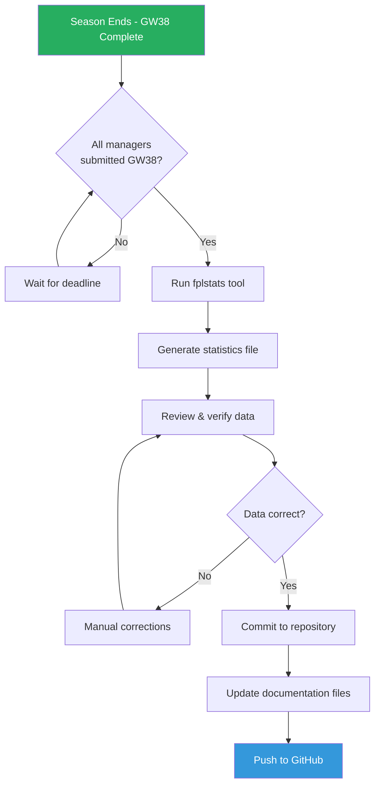

**Steps:**
1. Wait for GW38 to complete and all points finalized
2. Execute fplstats tool against league data
3. Export statistics to `statistics/YYYY_YYYY.txt`
4. Verify all 35+ categories generated correctly
5. Commit file with message "YYYY/YY" (e.g., "2024/25")
6. Update markdown documentation files
7. Push to master branch

### Procedure 2: Marathon Table Update

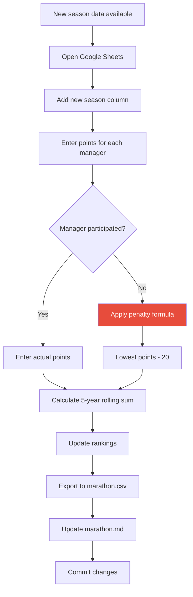

**Non-Participation Penalty Formula:**
```
penalty_points = min(all_manager_points_this_season) - 20
```

### Procedure 3: Hall of Fame/Shame Update

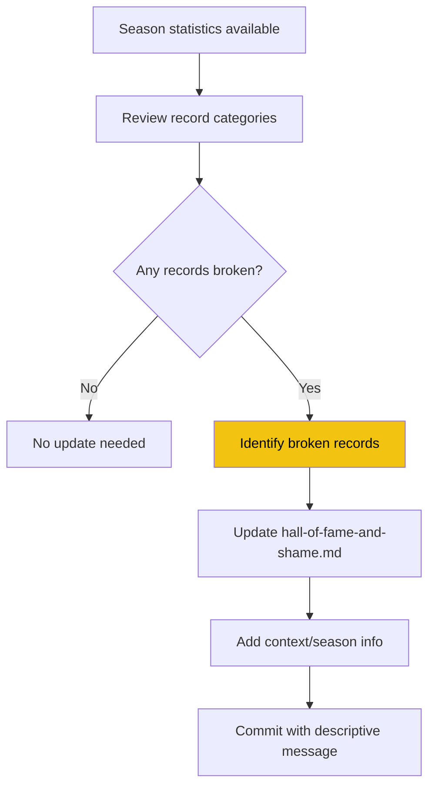

**Record Categories Tracked:**

| Hall of Fame | Hall of Shame |
|--------------|---------------|
| Highest GW rank | Lowest GW rank |
| Most participations | Traitor award (non-participation) |
| Most league titles | Lowest overall rank |
| Highest season points | - |
| Highest GW38 rank | - |

### Procedure 4: Cup Results Documentation

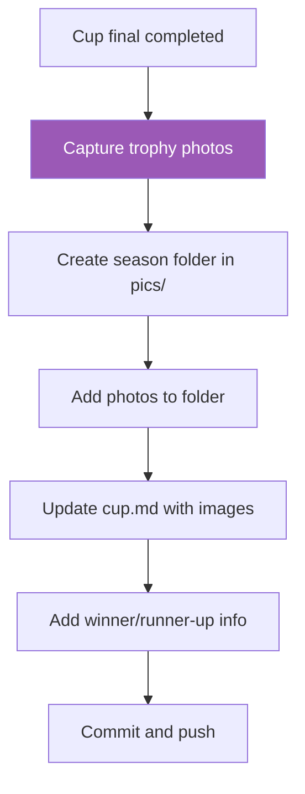

---

## Statistics Categories

### Complete Category Reference

The statistics system tracks **35+ categories** per season. Below is the complete reference:

#### Performance Categories

| Norwegian | English | Description |
|-----------|---------|-------------|
| ÅRETS VISJONÆRE | Visionary | What-if analysis for GW1 frozen picks |
| ÅRETS CAPTAIN FORESIGHT | Captain Foresight | Extra points from captaincy |
| ÅRETS CAPTAIN HINDSIGHT | Captain Hindsight | Points excluding captain bonus |
| ÅRETS MVP | MVP | Highest-scoring player per team |
| ÅRETS BESTE DIFF | Best Differential | Low-ownership high-point picks |

#### Position Categories

| Norwegian | English | Description |
|-----------|---------|-------------|
| ÅRETS LENGSTE LEDER | Longest Leader | Most GWs in 1st place |
| ÅRETS LENGSTE BALLETAK | Longest Bottom | Most GWs in last place |
| ÅRETS STØRSTE LEDER | Biggest Leader | Largest point gap when 1st |
| ÅRETS STØRSTE BALLETAK | Biggest Deficit | Largest gap when last |
| ÅRETS VINGLEPETTER | Position Swinger | Most different positions held |

#### Player Statistics

| Norwegian | English | Description |
|-----------|---------|-------------|
| ÅRETS GULLSTØVEL | Golden Boot | Most goals |
| ÅRETS ASSISTKONGE | Assist King | Most assists |
| ÅRETS MÅLRETTEDE | Goal + Assist | Combined attacking returns |
| ÅRETS FORSVARSLØSE | Defenseless | Most goals conceded |
| ÅRETS SKUDDSIKRE | Clean Sheet King | Most clean sheets |
| ÅRETS KEEPER | Goalkeeper | Best GK performance |

#### Form Categories

| Norwegian | English | Description |
|-----------|---------|-------------|
| ÅRETS FORMSPILLER | Form Player | Best 5-GW window |
| ÅRETS UTE-AV-FORMSPILLER | Out of Form | Worst 5-GW window |
| ÅRETS STABILE | Most Stable | Smallest GW variance |
| ÅRETS HIGHSCORE | High Score | Best single GW |
| ÅRETS LOWSCORE | Low Score | Worst single GW |

#### Squad Management

| Norwegian | English | Description |
|-----------|---------|-------------|
| ÅRETS BENKESLITER | Bench Warmer | Most unused bench points |
| ÅRETS SUPERINNBYTTER | Super Sub | Most auto-sub points |
| ÅRETS RUNDBRENNER | Rotation Master | Most unique players used |
| ÅRETS TEMPLATE | Template | Highest avg ownership |

#### Chip & Transfer

| Norwegian | English | Description |
|-----------|---------|-------------|
| ÅRETS CHIPP-KONGE | Chip King | Most chip points |
| ÅRETS PIMP | Transfer Master | Best transfer timing |
| ÅRETS SPÅMANN | Prophet | Same-GW transfer in points |
| ÅRETS KARMA | Karma | Same-GW transfer out points |

#### Negative Categories

| Norwegian | English | Description |
|-----------|---------|-------------|
| ÅRETS STYGGE SPILLER | Dirty Player | Most card points lost |
| ÅRETS SELVEIDE | Own Goal | Most own goals |
| ÅRETS BOMSPILLER | Penalty Miss | Most penalties missed |

#### Ranking Categories

| Norwegian | English | Description |
|-----------|---------|-------------|
| ÅRETS HØYESTE RANK | Highest Rank | Best GW/overall rank |
| ÅRETS LAVESTE RANK | Lowest Rank | Worst GW/overall rank |
| ÅRETS BONUSSPILLER | Bonus King | Most bonus points |
| ÅRETS VANILLA | Vanilla | Raw points (no chips/captain) |

---

## Appendices

### Appendix A: Git Commit Convention

```
# Season update
YYYY/YY

# File updates
Update [filename].md

# Corrections
Fix [description]

# New content
Add [description]
```

### Appendix B: File Naming Convention

```
Statistics:  YYYY_YYYY.txt (e.g., 2024_2025.txt)
Images:      descriptive-name.jpg
Data:        descriptive-name.csv/md
```

### Appendix C: External Resources

| Resource | URL |
|----------|-----|
| FPL Official | https://fantasy.premierleague.com |
| fplstats Tool | https://github.com/oyshan/fplstats |
| Google Sheets | https://docs.google.com/spreadsheets/d/137-UoJ2gj5-bD5h-LOOTsttm35dNv5QM7CocSbs0Zio |
| Repository | https://github.com/nplol/fantasypl |

### Appendix D: Historical Timeline

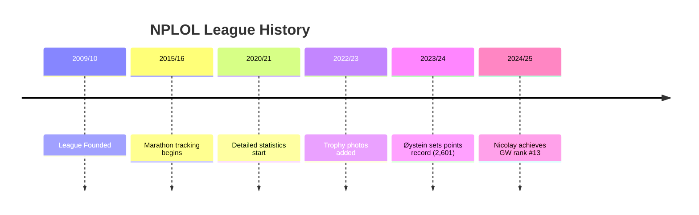

---

*Documentation generated: December 2025*
*Repository: github.com/nplol/fantasypl*
