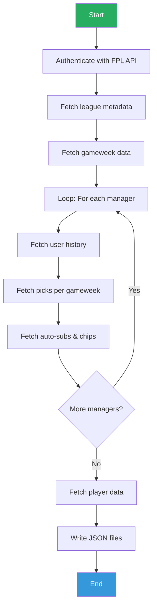
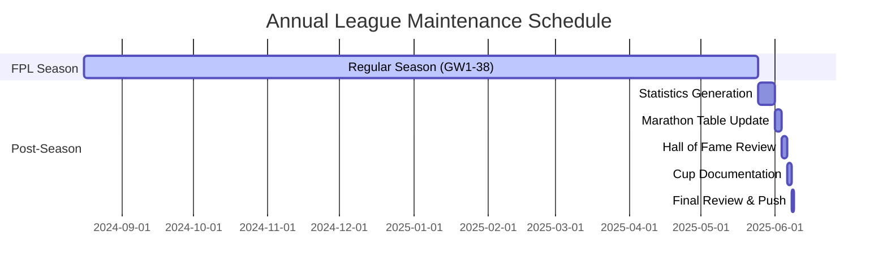
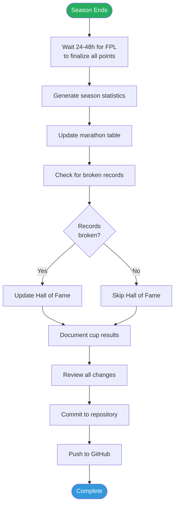
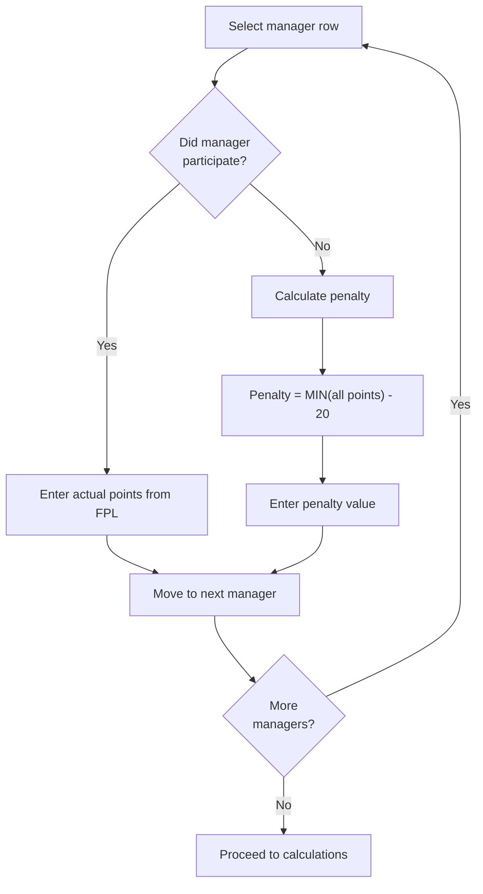
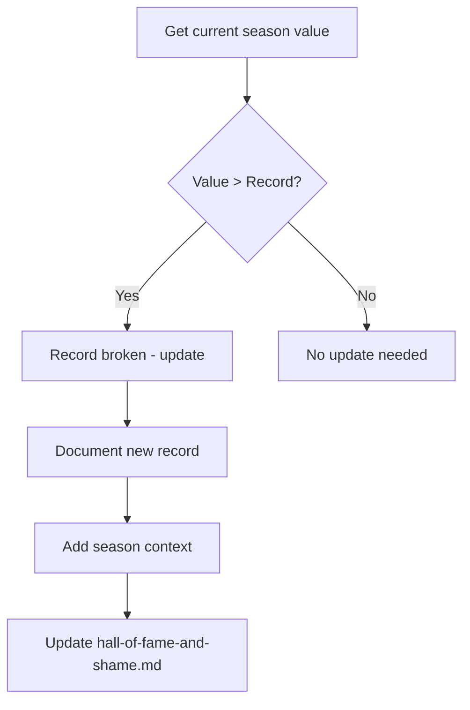

# NPLOL Fantasy Premier League - Operating Procedures

> Detailed step-by-step procedures for maintaining the league statistics and documentation

## Table of Contents

1. [Overview](#overview)
2. [Development Setup](#development-setup)
3. [Annual Workflow](#annual-workflow)
4. [Data Fetching Procedure](#data-fetching-procedure)
5. [Season-End Statistics Generation](#season-end-statistics-generation)
6. [Marathon Table Update](#marathon-table-update)
7. [Hall of Fame Update](#hall-of-fame-update)
8. [Cup Documentation](#cup-documentation)
9. [Data Validation](#data-validation)
10. [CLI Reference](#cli-reference)
11. [Troubleshooting](#troubleshooting)

---

## Overview

This document outlines the standard operating procedures for maintaining the NPLOL Fantasy Premier League statistics repository. All procedures are designed to be executed by league administrators after each FPL season concludes.

### Responsibility Matrix

| Task | Primary | Backup | Frequency |
|------|---------|--------|-----------|
| Statistics Generation | Admin | - | Annual |
| Marathon Table Update | Admin | - | Annual |
| Hall of Fame Update | Admin | - | When records broken |
| Cup Documentation | Admin | - | Annual |
| Repository Maintenance | Admin | - | As needed |

---

## Development Setup

### Prerequisites

- Python 3.13 (use `pyenv` for version management)
- pip and virtualenv
- FPL account credentials
- Browser access for cookie extraction

### Installation

```bash
# Navigate to src directory
cd /path/to/fantasypl/src

# Create virtual environment
python -m venv env

# Activate environment
source env/bin/activate  # macOS/Linux
# or
.\env\Scripts\activate   # Windows

# Install dependencies
pip install -r requirements.txt
```

### Dependencies

| Package | Version | Purpose |
|---------|---------|---------|
| fpl | 0.6.35 | FPL API client |
| pydantic | 1.8.1 | Data validation |
| prettytable | 2.1.0 | ASCII table output |
| mypy | 0.930 | Type checking |
| black | 21.5b0 | Code formatting |
| flake8 | 3.9.1 | Linting |

### Cookie Extraction

To fetch data from FPL, you need a browser cookie:

1. Log in to https://fantasy.premierleague.com
2. Open browser Developer Tools (F12)
3. Go to Console tab
4. Execute: `document.cookie`
5. Copy the entire output string

---

## Data Fetching Procedure

### Overview

The `fetch_league.py` script collects league data from the official FPL API and stores it locally as JSON files.

### Fetch Workflow



### Running the Fetch Script

```bash
cd /path/to/fantasypl/src

# Basic fetch (incremental - only new gameweeks)
python scripts/fetch_league.py \
    --league=1026627 \
    --email=your.email@example.com \
    --cookie="YOUR_COOKIE_STRING"

# Force fetch all data (re-download everything)
python scripts/fetch_league.py \
    --league=1026627 \
    --email=your.email@example.com \
    --cookie="YOUR_COOKIE_STRING" \
    --force-fetch-all

# Fetch including live/current gameweek
python scripts/fetch_league.py \
    --league=1026627 \
    --email=your.email@example.com \
    --cookie="YOUR_COOKIE_STRING" \
    --fetch-live
```

### Output Files

After running `fetch_league.py`, the following files are created:

```
src/data/{season}/{league_id}/
├── league.json      # League metadata and standings
├── gameweeks.json   # All 38 gameweeks info
├── user_list.json   # Simple manager list
├── users.json       # Complete manager data with history
└── players.json     # All players selected by league members
```

### Rate Limiting

The script implements automatic rate limiting:
- 4-second delay between user API calls
- 2-second delay between player fetches
- Prevents 429 (Too Many Requests) errors

### Incremental Fetching

By default, the script only fetches new gameweeks:
- Checks existing data for latest fetched gameweek
- Only fetches gameweeks after that point
- Use `--force-fetch-all` to override

---

## Annual Workflow

### Season Timeline



### High-Level Workflow



---

## Season-End Statistics Generation

### Prerequisites

- [ ] FPL season completed (GW38 finished)
- [ ] All bonus points allocated (24-48h after final game)
- [ ] Access to fplstats tool
- [ ] League ID available

### Procedure

#### Step 1: Verify Season Completion

```bash
# Check FPL API for final standings
# Ensure all managers have GW38 scores
# Verify bonus points are allocated
```

**Verification Checklist:**
- [ ] GW38 deadline passed
- [ ] All matches completed
- [ ] Bonus points visible in FPL app
- [ ] No pending point corrections announced

#### Step 2: Run Statistics Generator

```bash
# Navigate to src directory
cd /path/to/fantasypl/src

# Activate virtual environment
source env/bin/activate

# Run the analysis script
python scripts/analyze_league.py \
    --season=2024_2025 \
    --league=1026627 \
    --disable-prompt

# Or redirect output to file
python scripts/analyze_league.py \
    --season=2024_2025 \
    --league=1026627 \
    --disable-prompt > ../statistics/2024_2025.txt
```

**Command Options:**
| Flag | Description |
|------|-------------|
| `--season` | Season identifier (format: YYYY_YYYY) |
| `--league` | FPL league ID |
| `--disable-prompt` | Skip Enter prompts between stats |
| `--live` | Include ongoing gameweek data |

**Output:**
- Statistics file generated
- ~750 lines of ASCII-formatted tables
- 35+ statistical categories

#### Step 3: Verify and Export Statistics File

```bash
# If not already redirected, copy the generated output
# The script outputs directly to stdout

# Verify the output file
wc -l ../statistics/2024_2025.txt
# Should be approximately 750 lines

head -50 ../statistics/2024_2025.txt
# Check formatting and first few categories
```

**File Naming Convention:**
```
Format: YYYY_YYYY.txt
Example: 2024_2025.txt (for 2024/25 season)
```

#### Step 4: Validate Statistics

Run through validation checklist:

- [ ] File contains all 35+ categories
- [ ] All 10 managers listed in each category
- [ ] Points totals match FPL website
- [ ] Rankings are correctly ordered
- [ ] No formatting errors in ASCII tables

#### Step 5: Commit Statistics

```bash
cd /path/to/fantasypl

# Stage the new statistics file
git add statistics/YYYY_YYYY.txt

# Commit with season identifier
git commit -m "YYYY/YY"

# Example
git commit -m "2024/25"
```

### Statistics File Structure

```
┌─────────────────────────────────────────────────────────────────┐
│ ÅRETS [CATEGORY NAME]                                           │
│ [English description/subtitle]                                   │
├─────────────────────────────────────────────────────────────────┤
│ Rank │ Manager   │ Metric1    │ Metric2    │ Metric3           │
├──────┼───────────┼────────────┼────────────┼───────────────────┤
│ 1    │ Manager1  │ value      │ value      │ value             │
│ 2    │ Manager2  │ value      │ value      │ value             │
│ ...  │ ...       │ ...        │ ...        │ ...               │
│ 10   │ Manager10 │ value      │ value      │ value             │
└─────────────────────────────────────────────────────────────────┘
```

---

## Marathon Table Update

### Prerequisites

- [ ] Season statistics generated
- [ ] Access to Google Sheets
- [ ] Final points for all managers

### Procedure

#### Step 1: Open Google Sheets

Navigate to: `https://docs.google.com/spreadsheets/d/137-UoJ2gj5-bD5h-LOOTsttm35dNv5QM7CocSbs0Zio`

#### Step 2: Add New Season Column

1. Insert new column after most recent season
2. Add header: `YYYY/YY` (e.g., `2024/25`)
3. Format column to match existing style

#### Step 3: Enter Season Data

For each manager:



**Non-Participation Penalty Formula:**
```
If manager did NOT participate:
    penalty_points = MIN(points of all participating managers) - 20
    Mark with asterisk (*) in marathon.md
```

#### Step 4: Update Calculated Columns

1. **5-Year Rolling Sum:**
   - Sum of most recent 5 seasons
   - Formula: `=SUM([current year]:[current year - 4])`

2. **Total Sum:**
   - Sum of all seasons participated
   - Formula: `=SUM(all season columns)`

3. **Update Rankings:**
   - Sort by 5-year rolling sum (descending)
   - Assign ranks 1-10

#### Step 5: Export to CSV

```bash
# Export Google Sheet to CSV
# File > Download > Comma Separated Values (.csv)
# Save as marathon.csv

# Copy to repository
cp ~/Downloads/marathon.csv /path/to/fantasypl/marathon.csv
```

#### Step 6: Update marathon.md

Update the markdown file with new rankings:

```markdown
# Marathon

Ranking sortert etter 5 year rolling sum.

| Team | ... | YYYY/YY | 5 year rolling sum | sum |
| --- | --- | --- | --- | --- |
| Manager1 | ... | XXXX | XXXX | XXXX |
| Manager2* | ... | XXXX | XXXX | XXXX |
...
```

**Note:** Add asterisk (*) for managers who didn't participate in a season.

#### Step 7: Commit Changes

```bash
git add marathon.csv marathon.md
git commit -m "Update marathon.md"
```

---

## Hall of Fame Update

### Prerequisites

- [ ] Current season statistics available
- [ ] Previous records documented
- [ ] Understanding of record categories

### Record Categories

#### Hall of Fame Records

| Record | Metric | Current Holder | Current Value |
|--------|--------|----------------|---------------|
| Highest GW Rank | GW rank position | Nicolay | 13 of 11.5M |
| Most Participations | Seasons played | Severin | 16 |
| Most League Titles | 1st place finishes | Severin, Håvard, Øystein | 3 each |
| Most Cup Wins | Cup victories | Multiple | 1 each |
| Highest Season Points | Total points | Øystein | 2,601 |
| Highest Overall Rank | Season-end rank | Øystein | 2,011 |
| Best GW38 Rank | Final GW rank | Øystein | 3,449 of 10.9M |

#### Hall of Shame Records

| Record | Metric | Current Holder | Current Value |
|--------|--------|----------------|---------------|
| Traitor Award | Non-participation | Steffen | 2021/22, 2022/23 |
| Lowest GW Rank | Worst GW performance | Nicolay | 11.2M of 11.4M |
| Lowest Overall Rank | Worst season-end | Steffen | 6.1M of 11.5M |

### Procedure

#### Step 1: Review Current Season Performance

Check statistics file for potential record-breakers:

```bash
# Key sections to check:
# - ÅRETS HØYESTE RANK (Highest rank)
# - ÅRETS LAVESTE RANK (Lowest rank)
# - Final standings (total points)
# - Participation status
```

#### Step 2: Compare Against Records



#### Step 3: Update Documentation

Edit `hall-of-fame-and-shame.md`:

```markdown
## Hall of fame

| Attribute | Name | Value |
| --- | --- | --- |
| Highest GW-rank (FPL) | [Name] | [Rank] of [Total] (top X%) - [Season] |
...

## Hall of shame

| Attribute | Name | Value |
| --- | --- | --- |
| Traitor award | [Name] | [Season(s)] |
...
```

#### Step 4: Commit Changes

```bash
git add hall-of-fame-and-shame.md
git commit -m "Update hall-of-fame-and-shame.md"
```

---

## Cup Documentation

### Prerequisites

- [ ] Cup final completed
- [ ] Trophy photos taken
- [ ] Winner and runner-up confirmed

### Procedure

#### Step 1: Create Season Image Folder

```bash
cd /path/to/fantasypl/pics

# Create folder for new season
mkdir YYYY_YYYY

# Example
mkdir 2024_2025
```

#### Step 2: Add Trophy Photos

```bash
# Copy photos to folder
cp /path/to/photos/*.jpg YYYY_YYYY/

# Recommended naming:
# - winner.jpg (winner celebration)
# - trophy.jpg (trophy photo)
# - cup.jpg (cup ceremony)
# - balls.jpg (draw balls if applicable)
```

**Image Guidelines:**
- Format: JPG preferred
- Size: Reasonable file size (< 500KB each)
- Content: Trophy, winner, celebration moments

#### Step 3: Update cup.md

Add new season section at top of file:

```markdown
## YYYY/YY


```

#### Step 4: Commit Changes

```bash
git add pics/YYYY_YYYY/*
git add cup.md
git commit -m "Update cup.md"
```

---

## Data Validation

### Statistics Validation Checklist

| Check | Method | Expected |
|-------|--------|----------|
| Manager count | Count unique names | 10 managers |
| Category count | Count section headers | 35+ categories |
| Points accuracy | Compare to FPL | Match exactly |
| Ranking order | Check descending | Correct order |
| Formatting | Visual inspection | Clean ASCII tables |

### Marathon Table Validation

| Check | Method | Expected |
|-------|--------|----------|
| Row count | Count manager rows | 10 rows |
| Column count | Count season columns | All seasons |
| Sum accuracy | Verify calculations | Correct totals |
| Penalty marking | Check asterisks | Non-participants marked |

### Common Validation Issues

1. **Points Mismatch:**
   - Wait additional 24h for FPL corrections
   - Re-run statistics generator

2. **Missing Manager:**
   - Verify league membership
   - Check for name variations

3. **Formatting Errors:**
   - Check for special characters
   - Verify ASCII table alignment

---

## CLI Reference

### fetch_league.py

**Purpose:** Fetch league data from FPL API and store locally

```bash
python scripts/fetch_league.py [OPTIONS]
```

| Option | Short | Required | Description |
|--------|-------|----------|-------------|
| `--league` | `-l` | Yes | FPL league ID |
| `--email` | `-e` | Yes | FPL account email |
| `--cookie` | `-c` | Yes | Browser cookie from FPL |
| `--password` | `-p` | No | FPL password (prompted if omitted) |
| `--force-fetch-all` | | No | Re-download all data |
| `--fetch-live` | | No | Include current gameweek |

**Examples:**

```bash
# Weekly incremental fetch
python scripts/fetch_league.py -l 1026627 -e user@mail.com -c "cookie"

# End-of-season full fetch
python scripts/fetch_league.py -l 1026627 -e user@mail.com -c "cookie" --force-fetch-all

# Mid-gameweek live fetch
python scripts/fetch_league.py -l 1026627 -e user@mail.com -c "cookie" --fetch-live
```

### analyze_league.py

**Purpose:** Generate comprehensive statistics from fetched data

```bash
python scripts/analyze_league.py [OPTIONS]
```

| Option | Short | Required | Description |
|--------|-------|----------|-------------|
| `--season` | `-s` | Yes | Season (YYYY_YYYY format) |
| `--league` | `-l` | Yes | FPL league ID |
| `--disable-prompt` | | No | Skip Enter prompts |
| `--live` | | No | Include current gameweek |

**Examples:**

```bash
# Interactive analysis (prompts between stats)
python scripts/analyze_league.py -s 2024_2025 -l 1026627

# Non-interactive (for file output)
python scripts/analyze_league.py -s 2024_2025 -l 1026627 --disable-prompt > output.txt

# Live analysis during season
python scripts/analyze_league.py -s 2024_2025 -l 1026627 --live
```

### Python API Usage

You can also use the `LeagueAnalyzer` class directly:

```python
from fplstats.analyzers import LeagueAnalyzer

# Initialize analyzer
analyzer = LeagueAnalyzer(
    season="2024_2025",
    league_id=1026627,
    disable_prompt=True,
    live=False
)

# Run all statistics
analyzer.get_all_statistics()

# Or run individual methods
captain_data = analyzer.get_captain_foresight(print_result=False)
streaks = analyzer.get_best_streaks(print_result=False)
vanilla = analyzer.get_vanilla_standings(print_result=False)
```

### Available Statistics Methods

| Method | Norwegian Name | Description |
|--------|---------------|-------------|
| `get_gw1_picks_standings()` | Årets Visjonære | What-if GW1 frozen picks |
| `get_captain_foresight()` | Captain Foresight | Captain bonus points |
| `get_captain_hindsight()` | Captain Hindsight | Points without captain |
| `get_longest_leader()` | Lengste Leder | Most GWs in 1st place |
| `get_longest_loser()` | Lengste Balletak | Most GWs in last place |
| `get_biggest_leader()` | Største Leder | Largest point gap when leading |
| `get_biggest_loser()` | Største Balletak | Largest deficit when last |
| `get_top_scorers()` | Gullstøvel | Most goals by owned players |
| `get_assist_kings()` | Assistkonge | Most assists by owned players |
| `get_most_goal_involvements()` | Målrettede | Goals + assists |
| `get_most_goals_conceded()` | Forsvarsløse | Goals conceded |
| `get_most_clean_sheets()` | Skuddsikre | Clean sheets earned |
| `get_best_streaks()` | Formspiller | Best 5-GW window |
| `get_worst_streaks()` | Ute-av-formspiller | Worst 5-GW window |
| `get_most_stable_user()` | Stabile | Smallest GW variance |
| `get_most_bench_points()` | Benkesliter | Points on bench |
| `get_most_auto_sub_points()` | Superinnbytter | Auto-sub points |
| `get_best_differential()` | Beste Diff | Low-ownership returns |
| `get_most_chip_points()` | Chipp-Konge | Chip usage points |
| `get_most_hits()` | Pimp | Transfer hit analysis |
| `get_vanilla_standings()` | Vanilla | Raw points no chips |

---

## Troubleshooting

### Common Issues

#### Issue: Statistics file incomplete

```
Symptom: Missing categories in output
Cause: API timeout or rate limiting
Solution: Wait and retry, or run in batches
```

#### Issue: Points don't match FPL

```
Symptom: Total points differ from FPL website
Cause: FPL point corrections after generation
Solution: Wait 48h after season end, regenerate
```

#### Issue: Manager missing from statistics

```
Symptom: Only 9 managers in output
Cause: Manager left/joined league mid-season
Solution: Manually add with available data
```

#### Issue: Image not displaying in cup.md

```
Symptom: Broken image link
Cause: Incorrect GitHub raw URL
Solution: Verify path:
  https://raw.githubusercontent.com/nplol/fantasypl/master/pics/YYYY_YYYY/filename.jpg
```

### Emergency Procedures

#### Manual Statistics Generation

If fplstats tool unavailable:
1. Export data from FPL website
2. Manually create ASCII tables
3. Follow existing file format exactly

#### Data Recovery

If repository corrupted:
1. Clone fresh from GitHub
2. Restore from Google Sheets backup
3. Regenerate statistics if needed

---

## Quick Reference

### Git Commands

```bash
# View status
git status

# Stage all changes
git add .

# Commit with message
git commit -m "Message"

# Push to GitHub
git push origin master

# Pull latest
git pull origin master
```

### File Locations

| File | Path |
|------|------|
| Statistics | `statistics/YYYY_YYYY.txt` |
| Marathon | `marathon.md`, `marathon.csv` |
| Hall of Fame | `hall-of-fame-and-shame.md` |
| Cup | `cup.md` |
| Images | `pics/YYYY_YYYY/` |

### Key URLs

| Resource | URL |
|----------|-----|
| Repository | github.com/nplol/fantasypl |
| Google Sheets | [Marathon Spreadsheet](https://docs.google.com/spreadsheets/d/137-UoJ2gj5-bD5h-LOOTsttm35dNv5QM7CocSbs0Zio) |
| fplstats | github.com/oyshan/fplstats |
| FPL Official | fantasy.premierleague.com |

---

*Last updated: December 2025*
