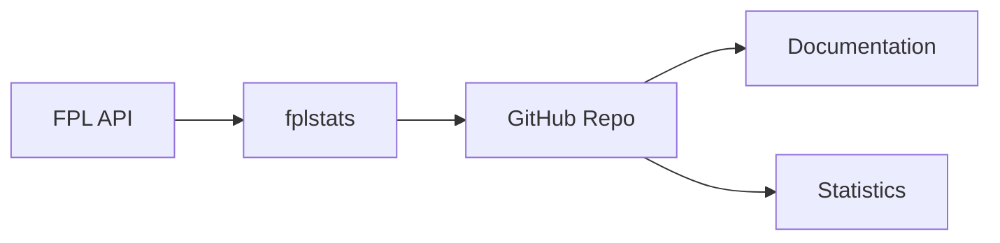

# NPLOL Fantasy Premier League - Documentation

> Technical documentation for the Norwegian FPL League (nplol) statistics system

## Documentation Index

| Document | Description |
|----------|-------------|
| [ARCHITECTURE.md](./ARCHITECTURE.md) | System architecture, data flow diagrams, and component overview |
| [PROCEDURES.md](./PROCEDURES.md) | Step-by-step operating procedures for league maintenance |
| [STATISTICS-REFERENCE.md](./STATISTICS-REFERENCE.md) | Complete reference guide for all 35+ statistical categories |

## Quick Links

### System Overview



### Key Resources

- **Repository**: [github.com/nplol/fantasypl](https://github.com/nplol/fantasypl)
- **Statistics Tool**: [github.com/oyshan/fplstats](https://github.com/oyshan/fplstats)
- **Google Sheets**: [Marathon Data](https://docs.google.com/spreadsheets/d/137-UoJ2gj5-bD5h-LOOTsttm35dNv5QM7CocSbs0Zio)

### Repository Structure

```
fantasypl/
├── docs/                    # This documentation
│   ├── README.md           # You are here
│   ├── ARCHITECTURE.md     # System architecture
│   ├── PROCEDURES.md       # Operating procedures
│   └── STATISTICS-REFERENCE.md
├── statistics/             # Season statistics (2020-2025)
├── pics/                   # Trophy photos
├── tabeller.md            # League tables
├── marathon.md            # 5-year rolling rankings
├── cup.md                 # Cup competition results
└── hall-of-fame-and-shame.md
```

## For League Administrators

Start with:
1. **ARCHITECTURE.md** - Understand the overall system
2. **PROCEDURES.md** - Learn the maintenance workflows
3. **STATISTICS-REFERENCE.md** - Reference for data interpretation

## For League Members

The most relevant files are in the parent directory:
- `tabeller.md` - Season standings
- `marathon.md` - 5-year rolling rankings
- `hall-of-fame-and-shame.md` - Records and achievements
- `cup.md` - Cup competition results

---

*Documentation generated December 2025*
