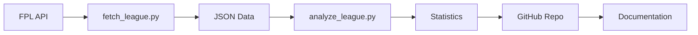

# NPLOL Fantasy Premier League - Documentation

> Technical documentation for the Norwegian FPL League (nplol) statistics system

## Documentation Index

| Document | Description |
|----------|-------------|
| [ARCHITECTURE.md](./ARCHITECTURE.md) | System architecture, data flow diagrams, software design, and component overview |
| [PROCEDURES.md](./PROCEDURES.md) | Step-by-step operating procedures, CLI reference, and development setup |
| [STATISTICS-REFERENCE.md](./STATISTICS-REFERENCE.md) | Complete reference guide for all 35+ statistical categories with code implementations |
| [HEADLESS-AUTH.md](./HEADLESS-AUTH.md) | Setup guide for the headless OAuth2 PKCE login (Playwright). One-time setup for refreshing FPL API tokens without manual cookie copy-paste |

## Quick Links

### System Overview



### Key Resources

- **Repository**: [github.com/nplol/fantasypl](https://github.com/nplol/fantasypl)
- **Google Sheets**: [Marathon Data](https://docs.google.com/spreadsheets/d/137-UoJ2gj5-bD5h-LOOTsttm35dNv5QM7CocSbs0Zio)

### Repository Structure

```
fantasypl/
├── docs/                    # This documentation
│   ├── README.md           # You are here
│   ├── ARCHITECTURE.md     # System + software architecture
│   ├── PROCEDURES.md       # Operating procedures + CLI reference
│   └── STATISTICS-REFERENCE.md  # 35+ categories explained
├── src/                     # Python statistics tool
│   ├── fplstats/           # Core analysis package
│   │   ├── analyzers.py    # LeagueAnalyzer (40+ methods)
│   │   ├── models.py       # Pydantic data models
│   │   ├── enums.py        # Chip, Position enums
│   │   └── utils.py        # File I/O utilities
│   ├── scripts/            # CLI entry points
│   │   ├── fetch_league.py # FPL API data fetcher
│   │   └── analyze_league.py  # Statistics generator
│   ├── data/               # Cached JSON (5 seasons)
│   └── requirements.txt    # Python dependencies
├── statistics/             # Generated season stats (2020-2025)
├── pics/                   # Trophy photos
├── tabeller.md            # League tables
├── marathon.md            # 5-year rolling rankings
├── cup.md                 # Cup competition results
└── hall-of-fame-and-shame.md
```

## Quick Start (Developers)

```bash
# Setup
cd src
python -m venv env
source env/bin/activate
pip install -r requirements.txt

# Fetch data
python scripts/fetch_league.py --league=1026627 --email=EMAIL --cookie=COOKIE

# Generate statistics
python scripts/analyze_league.py --season=2024_2025 --league=1026627
```

## For League Administrators

Start with:
1. **ARCHITECTURE.md** - Understand the overall system and software design
2. **PROCEDURES.md** - Learn the maintenance workflows and CLI commands
3. **STATISTICS-REFERENCE.md** - Reference for data interpretation and code

## For Developers

The `src/` directory contains the complete Python statistics tool:
- **fplstats package** - Core analysis engine (~3,200 lines)
- **LeagueAnalyzer class** - 40+ statistical methods
- **Pydantic models** - Type-safe data structures
- **CLI scripts** - fetch and analyze commands

See [PROCEDURES.md](./PROCEDURES.md) for development setup and CLI reference.

## For League Members

The most relevant files are in the parent directory:
- `tabeller.md` - Season standings
- `marathon.md` - 5-year rolling rankings
- `hall-of-fame-and-shame.md` - Records and achievements
- `cup.md` - Cup competition results

---

*Documentation generated December 2025*
