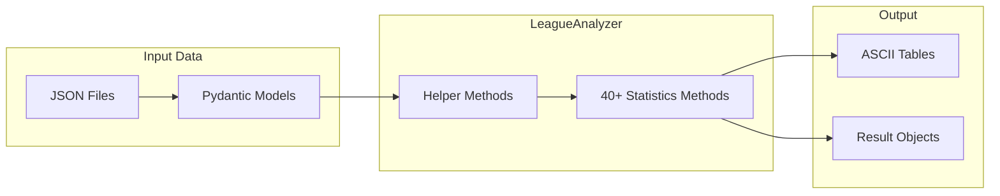

# NPLOL Fantasy Premier League - Statistics Reference Guide

> Complete reference for all 35+ statistical categories tracked across seasons

## Table of Contents

1. [Overview](#overview)
2. [Code Implementation](#code-implementation)
3. [Performance Categories](#performance-categories)
4. [Position & Leadership Categories](#position--leadership-categories)
5. [Player Statistics Categories](#player-statistics-categories)
6. [Form & Consistency Categories](#form--consistency-categories)
7. [Squad Management Categories](#squad-management-categories)
8. [Chip & Transfer Categories](#chip--transfer-categories)
9. [Negative Categories](#negative-categories)
10. [Ranking Categories](#ranking-categories)
11. [Calculation Methods](#calculation-methods)
12. [Data Interpretation](#data-interpretation)

---

## Overview

Each season's statistics file contains approximately **35+ distinct categories**, providing comprehensive analysis of every aspect of FPL management. This reference guide explains each category, its calculation method, and how to interpret the data.

### Category Structure

```
┌─────────────────────────────────────────────────────────────────┐
│ ÅRETS [NORWEGIAN NAME]                                          │
│ [English Translation / Description]                             │
├─────────────────────────────────────────────────────────────────┤
│ Rank │ Manager    │ Primary Metric │ Secondary Metrics...      │
├──────┼────────────┼────────────────┼───────────────────────────┤
│ 1    │ TopManager │ Best Value     │ Supporting data...        │
│ ...  │ ...        │ ...            │ ...                       │
│ 10   │ LastMgr    │ Lowest Value   │ Supporting data...        │
└─────────────────────────────────────────────────────────────────┘
```

---

## Code Implementation

### Source Location

All statistics are implemented in `src/fplstats/analyzers.py` within the `LeagueAnalyzer` class.

### Architecture Overview



### Key Helper Methods

| Method | Purpose | Used By |
|--------|---------|---------|
| `get_latest_gameweek()` | Returns latest finished GW | All methods |
| `get_historic_standings()` | GW-by-GW standings | Position methods |
| `get_gameweek_players()` | Players with points for user/GW | Player stats |
| `get_combined_gameweek_result_for_player()` | Aggregates DGW/TGW | All player methods |
| `get_player_gameweek_ownership_share()` | Ownership percentage | Differential |
| `print_result()` | PrettyTable output | All methods |

### Method Signature Pattern

All statistics methods follow this pattern:

```python
def get_[statistic_name](self, print_result=True) -> List[ResultRow]:
    """
    Calculate [statistic description].

    Args:
        print_result: If True, prints ASCII table to stdout

    Returns:
        List of result rows sorted by primary metric
    """
```

### Method-to-Category Mapping

| Category (Norwegian) | Method Name | Line Range |
|---------------------|-------------|------------|
| Årets Visjonære | `get_gw1_picks_standings()` | ~200-350 |
| Captain Foresight | `get_captain_foresight()` | ~350-450 |
| Captain Hindsight | `get_captain_hindsight()` | ~450-500 |
| Lengste Leder | `get_longest_leader()` | ~500-550 |
| Lengste Balletak | `get_longest_loser()` | ~550-600 |
| Største Leder | `get_biggest_leader()` | ~600-680 |
| Største Balletak | `get_biggest_loser()` | ~680-750 |
| Gullstøvel | `get_top_scorers()` | ~750-800 |
| Assistkonge | `get_assist_kings()` | ~800-850 |
| Målrettede | `get_most_goal_involvements()` | ~850-900 |
| Forsvarsløse | `get_most_goals_conceded()` | ~900-980 |
| Skuddsikre | `get_most_clean_sheets()` | ~980-1050 |
| Formspiller | `get_best_streaks()` | ~1100-1180 |
| Ute-av-formspiller | `get_worst_streaks()` | ~1180-1250 |
| Stabile | `get_most_stable_user()` | ~1250-1320 |
| Benkesliter | `get_most_bench_points()` | ~1320-1380 |
| Superinnbytter | `get_most_auto_sub_points()` | ~1380-1450 |
| Beste Diff | `get_best_differential()` | ~1550-1750 |
| Chipp-Konge | `get_most_chip_points()` | ~1800-1900 |
| Pimp | `get_most_hits()` | ~1900-2100 |
| Vanilla | `get_vanilla_standings()` | ~2600-2750 |

### Result Row Classes

Each statistic uses a specialized result class:

```python
class ResultRow(BaseModel):
    id: str           # User ID
    name: str         # User name

class CaptainResultRow(ResultRow):
    total_captain_points: int
    extra_captain_points: int
    captain_gameweeks: int
    vc_gameweeks: int

class LongestLeaderResultRow(ResultRow):
    first_place_count: int

class BiggestLeaderResultRow(ResultRow):
    point_gap: int
    gameweek: int

class TopScorerResultRow(ResultRow):
    goals_scored: int
```

---

## Performance Categories

### ÅRETS VISJONÆRE (Visionary of the Year)

**Purpose:** What-if analysis showing hypothetical scores if GW1 squad remained frozen

| Metric | Description |
|--------|-------------|
| GW1 Team | Squad selected for gameweek 1 |
| Hypothetical Total | Points accumulated by GW1 players through entire season |
| Actual Total | Manager's actual season points |
| Difference | Gap between hypothetical and actual |

**Code Implementation:**
```python
# Method: LeagueAnalyzer.get_gw1_picks_standings()
# Location: src/fplstats/analyzers.py

def get_gw1_picks_standings(self, print_result=True):
    # For each user, get GW1 picks
    # Simulate entire season with frozen squad
    # Apply auto-sub logic respecting formation rules:
    #   - MIN_DEFS = 3, MIN_MIDS = 2, MIN_FWDS = 1
    # Calculate captain/VC points
    # Return hypothetical vs actual comparison
```

**Calculation:**
```
For each player in GW1 starting XI:
    sum(player_points_all_gameweeks)
Add captain bonus from GW1 captain selection
```

**Interpretation:**
- Higher hypothetical = good initial squad picks
- Large positive difference = successful transfers improved squad
- Negative difference = transfers hurt overall performance

---

### ÅRETS CAPTAIN FORESIGHT (Captain Insight)

**Purpose:** Measures effectiveness of captain selection decisions

| Metric | Description |
|--------|-------------|
| Total Captain Points | All points from captain selections |
| Extra Points (C) | Bonus points from captain multiplier |
| Extra Points (VC) | Bonus points from vice-captain when activated |
| Triple Captain Points | Points from TC chip usage |

**Code Implementation:**
```python
# Method: LeagueAnalyzer.get_captain_foresight()
# Returns: List[CaptainResultRow]

def get_captain_foresight(self, print_result=True):
    for user in self.user_list:
        for gw in finished_gameweeks:
            picks = user.history[gw].picks
            captain = [p for p in picks if p.is_captain][0]
            # Extra points = (multiplier - 1) * player_points
            extra_captain_points += (captain.multiplier - 1) * captain_gw_points
```

**Calculation:**
```
Regular Captain: captain_points × 2 (bonus = captain_points × 1)
Triple Captain: captain_points × 3 (bonus = captain_points × 2)
Vice Captain (activated): vc_points × 2 (when captain doesn't play)
```

**Interpretation:**
- Higher extra points = better captain picks
- Low VC activation = good captain availability

---

### ÅRETS CAPTAIN HINDSIGHT (Captain in Retrospect)

**Purpose:** Shows base squad performance excluding captaincy bonus

| Metric | Description |
|--------|-------------|
| Non-Captain Points | Total points excluding captain bonus |
| Best Non-Captain | Highest-scoring non-captain player |
| Missed Captain Points | Points left on table from suboptimal picks |

**Calculation:**
```
non_captain_points = total_points - captain_bonus_points
```

**Interpretation:**
- High non-captain points = strong overall squad
- Compare with Captain Foresight to see captaincy impact

---

### ÅRETS MVP (Most Valuable Player)

**Purpose:** Identifies each manager's highest-scoring player

| Metric | Description |
|--------|-------------|
| Player Name | Highest scorer for manager's teams |
| Total Points | Points accumulated by MVP |
| Gameweeks Owned | Number of GWs player was in squad |
| Points Per GW | Average contribution |

**Interpretation:**
- Common MVPs across managers = template picks
- Unique MVPs = successful differential strategy

---

### ÅRETS BESTE DIFF (Best Differential)

**Purpose:** Rewards successful low-ownership picks

| Metric | Description |
|--------|-------------|
| Differential Points | Ownership-weighted point value |
| Total Points | Raw points from differentials |
| Average Ownership | Mean ownership of differential picks |
| Best Pick | Single highest differential return |

**Calculation:**
```
For players with ownership < 30%:
    diff_points = gw_points / ownership_percentage
    total_diff = sum(diff_points)
```

**Interpretation:**
- High differential points = successful contrarian picks
- Shows template-breaking strategy success

---

## Position & Leadership Categories

### ÅRETS LENGSTE LEDER (Longest Leader)

**Purpose:** Tracks gameweeks spent in first place

| Metric | Description |
|--------|-------------|
| Weeks in 1st | Total gameweeks leading the league |
| First Lead GW | When leadership was first achieved |
| Final Position | Season-end ranking |

**Interpretation:**
- Leader ≠ winner (can lose lead late)
- Shows season-long dominance

---

### ÅRETS LENGSTE BALLETAK (Longest Bottom)

**Purpose:** Tracks gameweeks spent in last place

| Metric | Description |
|--------|-------------|
| Weeks in Last | Total gameweeks in 10th position |
| First Bottom GW | When last place was first occupied |
| Final Position | Season-end ranking |

**Interpretation:**
- Resurrection stories (bottom to high finish)
- Consistent struggles vs temporary dips

---

### ÅRETS STØRSTE LEDER (Biggest Leader)

**Purpose:** Measures maximum point advantage while leading

| Metric | Description |
|--------|-------------|
| Max Gap | Largest lead over 2nd place |
| Gap GW | Gameweek when max gap achieved |
| Final Gap | Season-end margin |

**Interpretation:**
- Large gaps early may shrink
- Shows peak dominance moments

---

### ÅRETS STØRSTE BALLETAK (Biggest Deficit)

**Purpose:** Measures maximum point deficit while last

| Metric | Description |
|--------|-------------|
| Max Deficit | Largest gap to 9th place |
| Deficit GW | Gameweek when max deficit occurred |
| Recovery | Points gained from low point |

**Interpretation:**
- Large comebacks are notable
- Shows resilience or lack thereof

---

### ÅRETS VINGLEPETTER (Position Swinger)

**Purpose:** Counts unique league positions held

| Metric | Description |
|--------|-------------|
| Positions Held | Number of different ranks (1-10) |
| Best Position | Highest rank achieved |
| Worst Position | Lowest rank achieved |
| Final Position | Season-end ranking |

**Interpretation:**
- High swings = volatile season
- Low swings = consistent performance (good or bad)

---

## Player Statistics Categories

### ÅRETS GULLSTØVEL (Golden Boot)

**Purpose:** Tracks goals scored by squad players

| Metric | Description |
|--------|-------------|
| Total Goals | All goals by owned players |
| Top Scorer | Player with most goals |
| Goals Owned | Goals while in manager's squad |

**Calculation:**
```
For each gameweek:
    sum(goals scored by players in starting XI)
    sum(goals scored by bench players if subbed in)
```

---

### ÅRETS ASSISTKONGE (Assist King)

**Purpose:** Tracks assists by squad players

| Metric | Description |
|--------|-------------|
| Total Assists | All assists by owned players |
| Top Assister | Player with most assists |
| Assist Points | Points from assists (3 per assist) |

---

### ÅRETS MÅLRETTEDE (Goals + Assists Combined)

**Purpose:** Combined attacking returns

| Metric | Description |
|--------|-------------|
| G+A Total | Goals plus assists combined |
| Attack Points | Points from goals and assists |
| Per GW Average | Average attacking returns |

---

### ÅRETS FORSVARSLØSE (Defenseless)

**Purpose:** Tracks goals conceded by defenders/goalkeepers

| Metric | Description |
|--------|-------------|
| Goals Against | Goals conceded by DEF/GK |
| Lost CS Points | Clean sheet points missed |
| Worst GW | Most goals conceded single GW |

**Interpretation:**
- Fewer goals against = better defensive picks
- Correlates with clean sheet success

---

### ÅRETS SKUDDSIKRE (Clean Sheet King)

**Purpose:** Tracks clean sheets earned

| Metric | Description |
|--------|-------------|
| Clean Sheets | Total CS by DEF/GK |
| CS Points | Points from clean sheets |
| Best DEF/GK | Player with most CS |

**FPL Clean Sheet Points:**
- Goalkeeper: 4 points
- Defender: 4 points
- Midfielder: 1 point

---

### ÅRETS KEEPER (Goalkeeper Award)

**Purpose:** Goalkeeper-specific performance

| Metric | Description |
|--------|-------------|
| Saves | Total saves made |
| Save Points | Points from saves (1 per 3 saves) |
| Penalty Saves | Penalties stopped |
| GK Total | Combined GK points |

---

## Form & Consistency Categories

### ÅRETS FORMSPILLER (Form Player)

**Purpose:** Best 5-gameweek consecutive window

| Metric | Description |
|--------|-------------|
| Best 5GW Total | Highest 5-consecutive GW points |
| Window | GW range (e.g., GW10-14) |
| Average Per GW | Points per gameweek in window |

**Calculation:**
```
For each 5-GW window (GW1-5, GW2-6, ..., GW34-38):
    window_total = sum(points in window)
Best = max(all window_totals)
```

---

### ÅRETS UTE-AV-FORMSPILLER (Out of Form)

**Purpose:** Worst 5-gameweek consecutive window

| Metric | Description |
|--------|-------------|
| Worst 5GW Total | Lowest 5-consecutive GW points |
| Window | GW range of bad form |
| Average Per GW | Points per gameweek in window |

---

### ÅRETS STABILE (Most Stable)

**Purpose:** Measures consistency across gameweeks

| Metric | Description |
|--------|-------------|
| Range | Difference between best and worst GW |
| Std Deviation | Statistical variance |
| Best GW | Highest single GW score |
| Worst GW | Lowest single GW score |

**Calculation:**
```
range = max(gw_points) - min(gw_points)
Smaller range = more stable
```

---

### ÅRETS HIGHSCORE (High Score)

**Purpose:** Best single gameweek performance

| Metric | Description |
|--------|-------------|
| Points | Highest GW score |
| Gameweek | When achieved |
| Captain | Who was captained |
| Chip Used | Any chip activated |

---

### ÅRETS LOWSCORE (Low Score)

**Purpose:** Worst single gameweek performance

| Metric | Description |
|--------|-------------|
| Points | Lowest GW score |
| Gameweek | When occurred |
| Captain | Who was captained |
| Issues | Red cards, injuries, etc. |

---

## Squad Management Categories

### ÅRETS BENKESLITER (Bench Warmer)

**Purpose:** Points accumulated by unused substitutes

| Metric | Description |
|--------|-------------|
| Bench Points | Total points by bench players |
| Avg Per GW | Average bench points |
| Best Bench GW | Highest single bench score |
| Wasted Points | Points that didn't count |

**Interpretation:**
- High bench points = poor squad rotation
- Indicates transfer/selection inefficiency

---

### ÅRETS SUPERINNBYTTER (Super Sub)

**Purpose:** Points gained from automatic substitutions

| Metric | Description |
|--------|-------------|
| Auto-Sub Points | Points from activated subs |
| Auto-Subs Made | Number of substitutions |
| Best Sub | Highest single auto-sub return |

**FPL Auto-Sub Rules:**
1. Player didn't play (0 minutes) in starting XI
2. Bench player did play
3. Formation remains valid

---

### ÅRETS RUNDBRENNER (Rotation Master)

**Purpose:** Number of unique players used across season

| Metric | Description |
|--------|-------------|
| Unique Players | Different players owned |
| Active Transfers | Transfers made |
| Hit Points | Points spent on transfers |
| Turnover Rate | New players per GW |

**Interpretation:**
- High unique players = aggressive transfer strategy
- Low = set-and-forget approach

---

### ÅRETS TEMPLATE (Template Manager)

**Purpose:** How closely squad matches popular picks

| Metric | Description |
|--------|-------------|
| Avg Ownership | Average ownership % of squad |
| Template Score | Similarity to most-owned players |
| Unique Picks | Players owned by <10% |

**Calculation:**
```
For each GW:
    avg_ownership = mean(ownership_% of all 15 squad players)
Season avg = mean(all GW averages)
```

**Interpretation:**
- High template = safe, consensus picks
- Low template = differential strategy

---

## Chip & Transfer Categories

### ÅRETS CHIPP-KONGE (Chip King)

**Purpose:** Points gained from chip usage

| Metric | Description |
|--------|-------------|
| Total Chip Points | Combined chip returns |
| Bench Boost | Points from BB chip |
| Triple Captain | Extra points from TC |
| Free Hit | Points from FH GW |

**Chips Available (per season):**
- 2× Wildcard (unlimited transfers, 2 windows)
- 1× Bench Boost (all 15 players score)
- 1× Triple Captain (3× captain points)
- 1× Free Hit (temporary unlimited transfers)

---

### ÅRETS PIMP (Transfer Master)

**Purpose:** Effectiveness of transfer decisions

| Metric | Description |
|--------|-------------|
| Transfer Net | Points gained - hits taken |
| Successful Transfers | Transfers with positive return |
| Hit Points | Points spent on extra transfers |
| Best Transfer | Single highest return |

**Calculation:**
```
transfer_value = points_from_player_in - points_from_player_out - hit_cost
```

---

### ÅRETS SPÅMANN (Prophet Award)

**Purpose:** Same-gameweek transfer success

| Metric | Description |
|--------|-------------|
| Same-GW Points | Points from last-minute transfers |
| Transfers Count | Number of deadline transfers |
| Success Rate | % that scored well |

**Definition:** Points from players transferred IN during the same gameweek they score.

---

### ÅRETS KARMA (Karma Award)

**Purpose:** Points missed from transferred-out players

| Metric | Description |
|--------|-------------|
| Missed Points | Points by recently sold players |
| Painful Transfers | Transfers with immediate punishment |
| Worst Decision | Single biggest miss |

**Definition:** Points scored by players in the gameweek immediately AFTER being transferred out.

---

## Negative Categories

### ÅRETS STYGGE SPILLER (Dirty Player)

**Purpose:** Points lost to cards

| Metric | Description |
|--------|-------------|
| Yellow Cards | Count and points lost (-1 each) |
| Red Cards | Count and points lost (-3 each) |
| Total Lost | Combined negative points |

---

### ÅRETS SELVEIDE (Own Goal Award)

**Purpose:** Own goals scored by squad

| Metric | Description |
|--------|-------------|
| Own Goals | Count of OGs |
| Points Lost | -2 points per own goal |
| Unluckiest Player | Player with most OGs |

---

### ÅRETS BOMSPILLER (Penalty Miss Award)

**Purpose:** Missed penalties by squad

| Metric | Description |
|--------|-------------|
| Penalties Missed | Count of misses |
| Points Lost | -2 points per miss |
| Unluckiest Taker | Player with most misses |

---

## Ranking Categories

### ÅRETS HØYESTE RANK (Highest Rank)

**Purpose:** Best global ranking achieved

| Metric | Description |
|--------|-------------|
| Best GW Rank | Highest gameweek position |
| Best Overall | Highest season rank |
| Peak GW | When best rank achieved |
| Percentile | Top X% of all players |

**Calculation:**
```
percentile = (rank / total_players) × 100
```

---

### ÅRETS LAVESTE RANK (Lowest Rank)

**Purpose:** Worst global ranking

| Metric | Description |
|--------|-------------|
| Worst GW Rank | Lowest gameweek position |
| Worst Overall | Lowest season rank |
| Trough GW | When worst rank occurred |
| Bottom Percentile | Bottom X% of players |

---

### ÅRETS BONUSSPILLER (Bonus King)

**Purpose:** Bonus points accumulated

| Metric | Description |
|--------|-------------|
| Total Bonus | All bonus points |
| 3-Bonus Count | Times player got 3 BPS |
| Best Player | Highest bonus earner |

**FPL Bonus Points System:**
- 3 points: Best BPS in match
- 2 points: Second best BPS
- 1 point: Third best BPS

---

### ÅRETS VANILLA (Vanilla Ice)

**Purpose:** Raw points without enhancements

| Metric | Description |
|--------|-------------|
| Base Points | Points without chips/captain |
| No Captain Bonus | Excluding captain multiplier |
| No Chip Boost | Excluding chip benefits |

**Code Implementation:**
```python
# Method: LeagueAnalyzer.get_vanilla_standings()
# Location: src/fplstats/analyzers.py (~line 2600)

def get_vanilla_standings(self, print_result=True):
    for user in self.user_list:
        total_points = league_standings[user.id].total

        # Subtract captain bonus (already calculated)
        extra_captain_pts = get_captain_foresight_results[user.id]

        # Subtract auto-sub points
        auto_sub_pts = get_most_auto_sub_points_results[user.id]

        # Subtract bench boost points (if used)
        bench_boost_pts = calculate_bench_boost_bonus(user)

        vanilla_points = total_points - extra_captain_pts - auto_sub_pts - bench_boost_pts

    return sorted(results, key=lambda x: x.vanilla_points, reverse=True)
```

**Calculation:**
```
vanilla_points = total_points - captain_bonus - chip_bonus - autosub_points
```

**Interpretation:**
- Shows true squad-building ability
- Removes luck/timing factors

---

## Calculation Methods

### Standard Point Calculations

```
Player Points =
    + Minutes (2 for 60+, 1 for 1-59)
    + Goals (GK/DEF: 6, MID: 5, FWD: 4)
    + Assists (3)
    + Clean Sheet (GK/DEF: 4, MID: 1)
    + Saves (1 per 3)
    + Penalty Save (5)
    + Bonus (1-3)
    - Yellow Card (-1)
    - Red Card (-3)
    - Own Goal (-2)
    - Penalty Miss (-2)
    - Goals Conceded (-1 per 2 for GK/DEF)
```

### Rolling Averages

```python
def rolling_average(points, window=5):
    return [sum(points[i:i+window])/window
            for i in range(len(points)-window+1)]
```

### Differential Points

```python
def differential_points(player_points, ownership_pct):
    if ownership_pct < 0.30:  # Under 30% owned
        return player_points / ownership_pct
    return 0
```

---

## Data Interpretation

### Reading Statistics Tables

1. **Rank Column:** Position 1-10 in category
2. **Primary Metric:** Main sorting criterion
3. **Secondary Metrics:** Supporting context
4. **Parentheticals:** Additional details

### Comparing Across Seasons

- Absolute values may vary (FPL scoring changes)
- Relative rankings within season are comparable
- 5-year trends show improvement/decline

### Key Insights to Look For

1. **Consistency:** Low range/std deviation
2. **Risk-Taking:** High differential scores
3. **Timing:** Good chip/captain decisions
4. **Squad Building:** High vanilla points
5. **Luck Factor:** Compare actual vs expected

---

## Appendix: Norwegian-English Glossary

| Norwegian | English |
|-----------|---------|
| Årets | Of the Year |
| Visjonære | Visionary |
| Lengste | Longest |
| Største | Biggest |
| Leder | Leader |
| Balletak | Bottom (colloquial) |
| Gullstøvel | Golden Boot |
| Assistkonge | Assist King |
| Formspiller | Form Player |
| Stabile | Stable |
| Benkesliter | Bench Warmer |
| Superinnbytter | Super Substitute |
| Stygge | Dirty/Ugly |
| Bomspiller | Miss Player |
| Høyeste | Highest |
| Laveste | Lowest |
| Vinglepetter | Wobbler/Swinger |
| Spåmann | Prophet/Soothsayer |
| Rundbrenner | Burnout/Rotation |

---

*Reference Guide Version 1.0 - December 2025*
